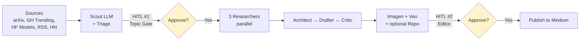

# gemini-agent-blueprint

> A production-grade reference architecture for Google's Gemini Agent Platform. A graph workflow that polls AI release sources, runs human-in-the-loop approvals over Telegram, generates assets, and publishes articles to Medium with optional code repos to GitHub.

[](https://www.python.org/downloads/)
[](https://google.github.io/adk-docs/)
[](LICENSE)
[](<MEDIUM_URL>)

## What it does at a glance



The two yellow gates are human-in-the-loop approval steps over Telegram. They can take up to 24 hours each — the architecture below explains how that's possible on serverless infrastructure.


*The Topic Gate posting an approval request to Telegram. Tap a button, the workflow resumes — even 24 hours later.*

## Why this exists

The first version of this agent deployed cleanly. Cloud Scheduler triggered hourly. Cloud Run returned HTTP 200. Logs streamed normally.

In three weeks of running, it produced exactly zero articles.

The cause wasn't a bug in the prompts or the model — it was an architectural mismatch I hadn't seen until production made it visible: the agent had two human-approval gates over Telegram, humans take roughly 24 hours to tap a button, and Cloud Run requests cap at 60 minutes. Every cycle timed out and lost its state.

I tried the obvious workarounds first. Polling for approval inside the request? Same 60-minute ceiling. Persisting the workflow state to Firestore between calls and rebuilding it on the next invocation? Each agent's internal context, partial tool outputs, and in-flight prompts were all opaque to me — I couldn't checkpoint what I couldn't see. Splitting the pipeline into multiple Cloud Run services chained by Pub/Sub? Workable, but I'd be reinventing what an agent runtime is supposed to give me, and I'd own the operational debt of every queue and DLQ.

This repo is the rebuild. It uses ADK 2.0's graph `Workflow` and `RequestInput` primitive, which lets the pipeline pause as a *suspended generator* — state persists, the request releases, and the resume happens on a separate event matched on `interrupt_id`. The 24-hour gate cost goes from "kills the workflow" to "free."

A few other lessons fell out of the rebuild and they're folded into the article:

- **Function nodes vs LlmAgents for non-LLM work.** My v1 wrapped image generation inside an LlmAgent and hit token-cap blowups every time the binary blob hit the LLM context. v2 calls Imagen directly from a function node and only passes the GCS URL forward. Same fix for Veo.
- **Dict-edge routing as a contract.** ADK 2.0 lets you set `ctx.route = "BRANCH_NAME"` and declare edges with a dict. That makes the routing logic a discoverable, testable artifact — not an `if/elif` chain hidden inside an agent's instruction.
- **Memory Bank for "have I covered this?".** Dedup against an embedding-backed memory of past topics, not against a Firestore-of-everything-I-once-saw. The Triage step queries it; the Publisher writes a fact back on success.
- **A graph-shape regression test.** A single pytest that diffs the workflow's edge structure against a snapshot. Catches accidental restructuring during refactors before the deploy step does.

📖 **[Read the full story →](<MEDIUM_URL>)** — five engineering lessons from rebuilding it.

## What's inside

**Capabilities**
- 7 polling sources (arXiv, GitHub Trending, HuggingFace Models + Papers, Anthropic news, HN, generic RSS)
- LLM-powered triage with Memory Bank dedup (covered + human-rejected fact types)
- Two HITL gates over Telegram (Topic, Editor) with 24h+ soft timeout via a sweeper cron
- 3-way parallel research (docs, GitHub repos, contextual web)
- Drafter ↔ Critic loop (max 3 iterations)
- Image generation via Imagen, video via Veo, both uploaded to public-read GCS
- Optional GitHub repo generation with starter code, commits, topics
- Medium publish via the official API
- Cloud Trace integration end-to-end

**Tech stack**

| Layer | Tech |
|---|---|
| Agent runtime | Google ADK 2.0b1 + Vertex AI Agent Runtime (managed, scale-to-zero) |
| LLM | Gemini 2.0 Flash + Pro (configurable per agent) |
| Image / Video | Imagen 3, Veo 2 |
| HITL transport | Telegram Bot API + Cloud Run webhook bridge |
| State | Vertex AI session storage + Firestore (bridge lookups) |
| Memory | Vertex AI Memory Bank (managed) |
| Storage | GCS (assets + staging tarballs) |
| Trigger | Cloud Scheduler (hourly + 15-min HITL sweeper) |
| Infrastructure | Terraform + a small Python deployer |
| Tests | pytest + pytest-asyncio (~89 tests, including graph-shape regression guard) |

## Architecture overview

The pipeline is a single ADK `Workflow` declared in [`agent.py`](agent.py). Five phases:

1. **Polling, Scout, Triage** — Scout LLM reads from 7 source pollers, produces ranked candidates as markdown-fenced JSON. `scout_split` parses it. Triage scores against Memory Bank ("covered" / "human-rejected" facts) and either picks one or skips the cycle.

2. **Topic Gate (HITL #1)** — `topic_gate_request` yields `RequestInput`, posts a Telegram message with Approve/Skip buttons. The workflow suspends — no HTTP request held — until the human responds (up to 24h).

3. **Research → Architect → Writer loop** — On approve, three researchers run in parallel (docs, GitHub repos, contextual). A `JoinFunctionNode` barriers the fan-in. Architect produces a structured outline. Drafter ↔ Critic loop refines for up to 3 iterations.

4. **Asset chain + Repo** — Imagen generates cover art (as a function node, NOT an LlmAgent — see ARCHITECTURE.md for why). Veo generates a short demo video. If `needs_repo` is set, `repo_builder` creates a GitHub repo with starter code.

5. **Editor (HITL #2) + Publish** — Same RequestInput pattern as Topic Gate. On approve, Publisher posts to Medium API and writes a Memory Bank fact.

**Key design patterns** (each of these is a section in [`docs/ARCHITECTURE.md`](docs/ARCHITECTURE.md)):
- Graph workflow with **dict-edge routing** (`ctx.route = "BRANCH"`)
- **`RequestInput`** for pause/resume — the architectural insight
- **`JoinFunctionNode`** for fan-in barriers (ADK 2.0 doesn't ship one)
- **Function nodes for non-LLM steps** (image gen, video gen) to avoid token-cap blowups from binary blobs

A few additional patterns the deep-dive covers:
- The Telegram bridge is its own Cloud Run service, separate from the agent. It receives webhooks, looks up the matching `interrupt_id` in Firestore, and POSTs a `FunctionResponse` back to the agent runtime. Keeping it a separate service means the agent itself never holds an HTTP connection while waiting on a human.
- The HITL sweeper runs every 15 minutes via Cloud Scheduler. It scans Firestore for pending interrupts older than the configured TTL and either sends a reminder or auto-resolves with a `timeout` decision. This is the soft-timeout that makes a 24h+ gate practical.
- Each `LlmAgent` reads its instruction string from `shared/prompts.py`. That separation makes the prompts the place to look when retargeting the agent for a new domain — the structural code in `agents/` rarely needs to change.

📐 **[Full architecture deep-dive (~6,600 words) →](docs/ARCHITECTURE.md)**

## Quick start — local exercise

This runs the agent locally with all external services mocked. Validates the workflow constructs, the 7 pollers fan out, and the first LLM call is wired correctly. Stops at the first HITL pause.

**Prereqs:**
- Python 3.12+
- [uv](https://docs.astral.sh/uv/) for dependency management
- A GCP project with Vertex AI enabled (only Vertex Gemini is hit; Imagen/Veo/GCS/GitHub/Medium are mocked)

**Steps:**

```bash
git clone https://github.com/<your-handle>/gemini-agent-blueprint
cd gemini-agent-blueprint

uv sync

cp .env.example .env
# Edit .env — at minimum set GOOGLE_CLOUD_PROJECT.

PYTHONPATH=. uv run python local_run.py
```

**Expected output:**
- Mocks installed line: `Mocks installed: Telegram, Firestore, Imagen, Veo, GCS, GitHub.`
- Workflow summary: `Workflow: gemini_agent_blueprint   edges=12   graph nodes=...`
- Streaming events from each phase up to the first HITL pause
- A mocked Telegram log at the Topic Gate showing what the message would have been
- Final state dump

If this runs to the Topic Gate pause, you've validated polling + Scout + Triage end-to-end against real Vertex Gemini.

## Full deployment

The full deploy spans 5 phases — terraform + Python + Docker + gcloud. Estimated time for first deploy: **1–2 hours.**

**Additional prereqs (beyond Quick Start):**
- A Telegram bot from [@BotFather](https://t.me/BotFather) and the chat ID where you want approvals posted
- A GitHub PAT with `repo` scope (used by repo_builder to create per-article repos)
- A Medium account + integration token (for the Publisher)
- Firestore enabled in your GCP project (Native mode)
- `terraform` CLI installed
- Docker installed (for the Telegram bridge image)

**Deployment phases:**

1. **Phase 1 — Enable Firestore** (one-time per project). Firestore Native mode is required for the Telegram bridge's `interrupt_id` lookup table. The terraform module does not enable Firestore on your behalf — that's a one-shot console action.

2. **Phase 2 — `terraform apply`** — provisions buckets, secrets, service accounts, IAM. The module is in `deploy/terraform/`. It reads `TF_VAR_project_name` (default `gab`) and derives all resource names from it, so forking into your own namespace is just a variable change.

3. **Phase 3 — `python deploy.py`** — packages the agent and creates the Vertex AI Agent Runtime engine. This is the step that registers the deployed `Workflow` with Vertex AI; the engine ID is written back to a local file for later reference.

4. **Phase 4 — Build + deploy the Telegram bridge** — the `telegram_bridge/` directory is a small FastAPI app deployed as a Cloud Run service. It receives Telegram webhook callbacks, resolves them to interrupt IDs, and POSTs `FunctionResponse` events back to the agent runtime. Build it with the included `Dockerfile` and deploy with `gcloud run deploy`.

5. **Phase 5 — Cloud Scheduler + Telegram webhook registration** — two Cloud Scheduler jobs (hourly trigger + 15-min HITL sweeper) plus a one-shot `setWebhook` call against the Telegram Bot API to point the bot at the bridge.

📖 **[Full step-by-step runbook →](deploy/terraform/README.md)**

The runbook is parameterized — all resource names derive from `var.project_name` (default `"gab"`). Set `TF_VAR_project_name=myagent` to fork into your own resource namespace.

## Forking for your own topic

This is set up to be forkable. The agent's *shape* (workflow graph, HITL gates, asset generation, dual publish targets) is generic; the *domain* (AI releases) lives in 4 files. To retarget the agent for your own topic:

**Step 0 — Rename the project.** Set these in your `.env`:

```bash
TF_VAR_project_name=myagent              # 2-14 chars, [a-z0-9-], starts with letter
PROJECT_DISPLAY_NAME=my-content-agent
PROJECT_APP_NAME=my_content_agent        # must be valid Python identifier
```

All terraform resources, deploy.py constants, and the workflow's internal name flow from these.

**Step 1 — Swap the source pollers.**

Edit [`tools/pollers.py`](tools/pollers.py). Each poller is a function returning a list of dicts with `title`, `url`, `source`, `published_at`, `summary`. Replace the AI-release sources with your domain's sources (e.g., RSS feeds, vendor APIs, scraped pages). The Scout LLM doesn't care where the dicts came from — it just needs a uniform shape to rank.

**Step 2 — Rewrite the prompts.**

Edit [`shared/prompts.py`](shared/prompts.py) — 11 LlmAgent instruction strings live here. Replace each with prompts framed for your domain. The structure (Scout produces JSON, Architect produces an outline, Critic verifies the draft, etc.) stays. Keep the JSON schemas intact — the function nodes downstream parse against them.

**Step 3 — Update the scout source list.**

Edit [`agents/scout.py`](agents/scout.py) — the scout's `tools=[...]` list points at the pollers from Step 1. Add/remove entries to match your sources.

**Step 4 — Decide on the repo builder.**

Edit [`agents/repo_builder.py`](agents/repo_builder.py) — this is the "produce a starter code repo" feature, very specific to AI/dev content. If your topic doesn't need code repos:
- Easiest: route around it. In `agent.py`, change the `route_needs_repo` branch to skip `repo_builder` always (set `needs_repo = False` in the architect's prompt).
- Cleaner: delete the repo_builder LlmAgent + node entirely, and the route.

**What you don't need to touch (in most forks):**
- `nodes/` — the function nodes (routing, HITL, aggregation, asset gen, records) are domain-agnostic.
- `tools/telegram.py`, `tools/gcs.py`, `tools/imagen.py`, `tools/veo.py`, `tools/medium.py` — the integration code stays as-is.
- `agent.py` — the workflow graph itself is the same shape regardless of domain. You only edit it if you're adding/removing whole phases (e.g., dropping the video step).
- `deploy/terraform/` — the IaC is parameterized; the only change is `TF_VAR_project_name`.

**Examples of forks you could build:**
- Research-paper digest (poll arXiv only, longer summaries, no repo)
- Security advisory tracker (poll CVE feeds, terse summaries, urgent Telegram alerts)
- Sports-news bot (poll team RSS, image-heavy, social tone)
- Your own thing

📖 More on the design tradeoffs in the [Medium article](<MEDIUM_URL>) →

## Project structure

```
.
├── agent.py                  # The Workflow root — canonical control-flow document
├── local_run.py              # Local dev driver with all externals mocked
├── deploy.py                 # One-shot Vertex AI Agent Runtime deployer
│
├── agents/                   # 7 LlmAgent definitions (Scout, Triage, 3 Researchers, Drafter, Critic, etc.)
├── nodes/                    # 12 function nodes (routing, HITL, aggregation, asset gen, records)
├── tools/                    # 11 tool integrations (pollers, telegram, github, gcs, imagen, veo, medium, ...)
├── shared/                   # Pydantic state models + prompts
├── telegram_bridge/          # Cloud Run webhook service (separate from main agent)
│
├── deploy/terraform/         # Terraform module for IAM, buckets, secrets, SAs
├── tests/                    # pytest suite (~89 tests)
│
├── docs/
│   ├── ARCHITECTURE.md       # Architecture deep-dive (~6,600 words)
│   └── img/                  # Diagrams + screenshots
│
├── pyproject.toml
├── uv.lock
├── .env.example
├── LICENSE
└── README.md                 # this file
```

## Testing

```bash
uv run pytest
```

Runs the full suite (~89 tests), including:
- Per-node unit tests (each function node has a test for its routing decisions and state mutations)
- Memory Bank facade tests (with InMemoryMemoryService backing)
- Telegram helper tests (callback_data encoding, Firestore lookup)
- Telegram bridge tests (FastAPI route handlers, FunctionResponse construction)
- A graph-shape regression test ([`tests/test_graph_shape.py`](tests/test_graph_shape.py)) that asserts the workflow's edge structure matches the design — catches accidental restructuring, fan-in regressions, and orphaned nodes

## Roadmap & known limitations

**Limitations to know going in:**
- ADK 2.0 is currently at `2.0.0b1` (Beta). API may break before GA. The pin in `pyproject.toml` is exact for this reason.
- Default region is `us-west1`. Vertex AI Agent Runtime requires a regional endpoint and not all regions are supported. Override with `REGION` env var.
- Video output is MP4-only (Veo). No GIF / WebM transcoding.
- Polling cadence is fixed at 1 cycle per hour via Cloud Scheduler. Multi-cycle parallelism is not designed in.
- Single Telegram chat for both HITL gates — no per-user routing.

**What this is and isn't:**
- A reference implementation that works end-to-end and is honest about its tradeoffs.
- A starting point — the README's "Forking for your own topic" section is the intended adoption path.
- Not a maintained OSS product. Issues and PRs are welcome but not committed-to.
- Not a no-code platform. You'll be writing Python and Terraform.

## Read the story • Connect

- 📖 **Medium article:** [The full story behind this build](<MEDIUM_URL>)
- 🐦 **Tweet thread:** [the 5-tweet version](<TWITTER_URL>)
- 💼 **LinkedIn:** [the standalone post](<LINKEDIN_URL>)

I'm a full-stack developer focused on AI/LLM-powered applications. Primary languages: Python, TypeScript. Find me on [GitHub](https://github.com/<your-handle>) and [Twitter](https://twitter.com/<your-handle>).

## License & acknowledgements

[MIT](LICENSE) © 2026 Rahul Patel.

Built on:
- [Google Agent Development Kit (ADK) 2.0](https://google.github.io/adk-docs/)
- [Vertex AI Agent Runtime](https://cloud.google.com/vertex-ai/docs/agent-runtime)
- [Vertex AI Memory Bank](https://cloud.google.com/vertex-ai/docs/memory-bank)
- [python-telegram-bot](https://github.com/python-telegram-bot/python-telegram-bot)
- [PyGithub](https://github.com/PyGithub/PyGithub)
- [feedparser](https://github.com/kurtmckee/feedparser), [arxiv](https://github.com/lukasschwab/arxiv.py), [huggingface_hub](https://github.com/huggingface/huggingface_hub)
