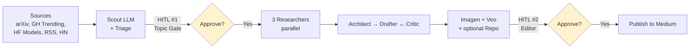

# Architecture

This document is the deep-dive companion to the project README. It assumes you have read the high-level overview and now want to understand how the pieces fit, why they fit that way, and where the dragons are. Code excerpts cite real symbols in the repo so you can jump straight to the source after reading any section.

## 1. Overview and problem statement

The blueprint solves one specific problem: **running a 24-hour human-in-the-loop pipeline on a serverless, request/response runtime that has no native pause primitive**. The system polls a curated set of AI release sources every hour, drafts a publication-ready article via a multi-agent graph, and gates the run on two human approvals — a topic gate and an editor gate — that may take a full day to come back. The agent must survive that wait, on a platform whose request lifecycle is bounded in minutes.

The solution is a graph workflow built on ADK 2.0's `Workflow` primitive, deployed to Vertex AI Agent Runtime. Every human checkpoint is expressed as a `RequestInput` event that suspends the workflow and detaches it from any open HTTP request. A small Cloud Run bridge translates Telegram button taps into `FunctionResponse` parts that resume the suspended session. A Cloud Scheduler "sweeper" sends a synthetic `verdict=timeout` after 24 hours so timed-out runs end cleanly instead of leaking sessions. The pipeline pays exactly zero compute while paused, because there is no compute — only persisted session state in Vertex's managed sessions service.

The control flow is deterministic. LLM agents do work; they do not orchestrate. Routing happens in plain Python function nodes that set `ctx.route = "BRANCH"`, and a dict-edge selects the next node. Fan-out is a tuple in the dict-edge value; fan-in uses a counter-gated `JoinFunctionNode` because ADK does not provide a barrier primitive. The result is a graph you can read top-to-bottom in `agent.py` without guessing what a model might decide to do next.

What this architecture is **not**:

- **Not a chat agent.** The only human surface is Telegram, and the only interactions are approve/skip/reject button taps. There is no streaming response, no multi-turn dialog, no end-user UI.
- **Not real-time.** Each cycle takes 5–30 minutes of compute plus up to 24 hours of HITL wait. Operators tolerate latency because the alternative is wrong articles.
- **Not multi-tenant.** One Telegram chat ID, one bot token, one GCP project, one Memory Bank scope. Multi-tenancy would require additional scoping work in the Memory Bank adapter and the Telegram bridge — explicitly out of scope.

If you are looking for the "why this exists" narrative — the war stories that produced these design choices — those live in the companion Medium article at `<MEDIUM_URL>`. This document focuses on the "what" and the "how."

---

## 2. The workflow graph

The pipeline is a single `Workflow` declared in `agent.py`. Every node, every edge, and every routing decision is right there. There is no nested orchestrator, no LLM that decides what runs next, no "agent transfer" by prompt.

### The five-phase flowchart



Five phases, two yellow gates. Phases 1, 3, 4, and 5 are mostly LLM work; phases 2 and 5 are where the pipeline parks itself for hours waiting on a human. Three patterns recur across the graph and deserve up-front explanation.

### Pattern 1 — Dict-edge routing

The natural assumption when reading `Workflow(edges=[...])` for the first time is that `Event(output="BRANCH")` from a function node is enough to drive a conditional edge. It is not. **`ctx.route = "BRANCH"` is mandatory**; the dict-edge form `{"BRANCH": next_node}` reads `ctx.route`, not the event payload. Returning the route string only as `Event(output=...)` produces a workflow that runs the route node and then halts because no destination matches. Spike scripts caught this on day one of the rebuild — every routing function node in `nodes/routing.py` sets both `ctx.route` (for the dispatcher) and `Event(output=...)` (for traces and tests):

```python
def route_after_triage(node_input, ctx: Context) -> Event:
    if ctx.state.get("chosen_release") is None:
        ctx.route = "SKIP"
        return Event(output={"route": "SKIP", "reason": ctx.state.get("skip_reason")})
    ctx.route = "CONTINUE"
    return Event(output={"route": "CONTINUE", "title": ctx.state["chosen_release"]["title"]})
```

### Pattern 2 — Tuple fan-out (parallel execution)

A tuple as a dict-edge value triggers all listed nodes in parallel. The Topic Gate's approve branch fans out to three researchers:

```python
(topic_gate_request, record_topic_verdict, route_topic_verdict, {
    "approve":  (docs_researcher, github_researcher, context_researcher),
    "skip":     record_human_topic_skip,
    "timeout":  record_topic_timeout,
}),
```

Two things ADK does **not** do for you here. First, it does not enforce that the parallel branches converge before the next node runs — that is your problem (see Pattern 3). Second, it does not prevent each branch from independently re-triggering downstream nodes if multiple unconditional edges point at the same successor. The unconditional pattern looks like this in `agent.py`:

```python
(docs_researcher,    gather_research),
(github_researcher,  gather_research),
(context_researcher, gather_research),
```

Each predecessor's completion fires an event into `gather_research`. Without a barrier, the entire downstream chain (architect → drafter → critic → ...) cascades three times.

### Pattern 3 — JoinFunctionNode (fan-in barrier)

The barrier is `JoinFunctionNode`, defined in `nodes/_join_node.py`:

```python
class JoinFunctionNode(FunctionNode):
    """FunctionNode with wait_for_output=True. Use for nodes with multiple
    unconditional incoming edges in the workflow graph."""
    wait_for_output: bool = True
```

`wait_for_output=True` keeps the node in `WAITING` state when its function returns an `Event` with no output. Predecessors keep firing it until the function decides "all inputs ready" and returns an `Event(output=...)`. The decision is gated by an explicit counter held in state. `gather_research` in `nodes/aggregation.py` increments a `gather_research_call_count` field on each call and only emits output once it reaches three:

```python
n = ctx.state.get("gather_research_call_count", 0) + 1
ctx.state["gather_research_call_count"] = n
if n < 3:
    return Event()  # WAITING — predecessors can re-trigger.
```

The state schema declares the counter explicitly so ADK's typed-state validation does not bounce the writes. This pattern is reusable: any fan-in node with multiple unconditional incoming edges should subclass `JoinFunctionNode` and gate on a counter. Plain `FunctionNode` will cascade.

### The full edge list

The graph is small enough to fit in one screen. Here is the canonical declaration from `agent.py`:

```python
root_agent = Workflow(
    name=os.environ.get("PROJECT_APP_NAME", "gemini_agent_blueprint"),
    state_schema=PipelineState,
    edges=[
        # 1. Scout → scout_split → Triage → route on chosen_release
        ("START", scout, scout_split, triage, route_after_triage, {
            "SKIP":     record_triage_skip,
            "CONTINUE": topic_gate_request,
        }),

        # 2. Topic Gate (HITL #1) — fan-out to research on approve
        (topic_gate_request, record_topic_verdict, route_topic_verdict, {
            "approve":  (docs_researcher, github_researcher, context_researcher),
            "skip":     record_human_topic_skip,
            "timeout":  record_topic_timeout,
        }),

        # 3. Research join → Architect → Writer loop
        (docs_researcher,    gather_research),
        (github_researcher,  gather_research),
        (context_researcher, gather_research),
        (gather_research, architect_llm, architect_split, drafter,
                          critic_llm, critic_split,
                          route_critic_verdict, {
            "REVISE": drafter,
            "ACCEPT": image_asset_node,
        }),

        # 4. Asset chain → repo router → editor
        (image_asset_node, video_asset_or_skip, gather_assets),
        (gather_assets, route_needs_repo, {
            "WITH_REPO":    repo_builder,
            "WITHOUT_REPO": editor_request,
        }),
        (repo_builder, editor_request),

        # 5. Editor (HITL #2) — approve / revise loop / reject
        (editor_request, record_editor_verdict, route_editor_verdict, {
            "approve":  publisher,
            "reject":   record_editor_rejection,
            "revise":   revision_writer,
            "timeout":  record_editor_timeout,
        }),
        (revision_writer, editor_request),  # loop back into HITL
    ],
)
```

Two self-loops are worth pointing at: `route_critic_verdict` loops back to `drafter` until the critic accepts (capped at three iterations in code), and `revision_writer` loops back to `editor_request` until the editor approves, rejects, or hits its own three-iteration cap. Loops are graph self-edges, not a special primitive — ADK 2.0 has no `LoopAgent` equivalent.

---

## 3. State schema

The workflow's state is a single Pydantic model: `PipelineState` in `shared/models.py`. The `Workflow` is constructed with `state_schema=PipelineState`, which makes ADK validate every `ctx.state[...]` write against the schema and reject misnamed keys at workflow-construction time. This eliminates the entire class of "typo in state key, silent no-op" bugs that plague dict-based state.

Fields are grouped by phase. Every state key the graph ever touches is declared once in this single file.

| Phase | Fields | Notes |
|---|---|---|
| Trigger | `last_run_at` | Set by the scheduler payload at START. |
| Scout | `scout_raw`, `candidates` | Raw markdown-fenced JSON in `_raw`; `scout_split` parses to `list[Candidate]`. |
| Triage | `chosen_release`, `skip_reason`, `chosen_release_write_count` | Counter exists because Triage's flash-lite model re-evaluates 4–10 times; first-write-wins prevents flip-flop. |
| HITL #1 | `topic_verdict` | Set by `record_topic_verdict` from the resume input. |
| Research | `docs_research`, `github_research`, `context_research`, `research`, `gather_research_call_count` | Three raw strings + one merged dossier; counter gates the fan-in barrier. |
| Architect | `architect_raw`, `outline`, `image_briefs`, `video_brief`, `needs_video`, `needs_repo` | One LLM call → five typed fields via `architect_split`. |
| Writer | `draft`, `critic_raw`, `critic_verdict`, `critic_feedback`, `writer_iterations` | Loop counter capped at 3 in `route_critic_verdict`. |
| Assets | `image_assets`, `video_asset` | Function nodes write typed lists directly — no LLM in this phase. |
| Repo | `starter_repo_raw`, `starter_repo` | LLM emits raw JSON; consumers parse on read. |
| HITL #2 | `editor_verdict`, `human_feedback`, `editor_iterations` | Loop counter capped at 3 in `record_editor_verdict`. |
| Publisher | `final_markdown`, `asset_bundle_url`, `memory_bank_recorded` | Set by the terminal happy-path node. |
| Outcome | `cycle_outcome` | Set by exactly one terminal node — six possible values. |

### The dict-versus-model rehydration gotcha

State persistence turns Pydantic models into dicts when the session is rehydrated mid-pause. Code that wrote `ctx.state["chosen_release"] = ChosenRelease(...)` and reads it back after a HITL pause will get a `dict`, not a `ChosenRelease`. Code that does `obj.title` will raise `AttributeError`.

The fix is a tiny attribute-or-key helper used everywhere a node reads a state-persisted model. Here is the version in `nodes/hitl.py`:

```python
def _attr(obj: object, name: str):
    """Read attr from a model OR key from a dict — state-persisted
    Pydantic models come back as dicts after rehydration."""
    if obj is None:
        return None
    if isinstance(obj, dict):
        return obj.get(name)
    return getattr(obj, name, None)
```

The publisher takes a more aggressive approach: it re-coerces dicts into model instances at the top of the function so the rest of the body can use attribute access freely. Either pattern is fine; the discipline is to never assume model identity across a pause.

---

## 4. Per-phase walkthrough

### 4.1 Phase 1 — Polling, Scout, Triage

The cycle starts when Cloud Scheduler POSTs `{"trigger": "scheduler"}` to the Vertex Agent Runtime endpoint. The `START` edge runs Scout, an `LlmAgent` configured with seven polling tools: `poll_arxiv`, `poll_github_trending`, `poll_rss`, `poll_hf_models`, `poll_hf_papers`, `poll_hackernews_ai`, and `poll_anthropic_news`. Each tool is a plain Python function in `tools/pollers.py` that catches its own exceptions and returns `[]` on failure (the fail-open contract). A single dead source produces an empty list, not a crashed cycle.

Scout's prompt mandates calling every tool concurrently and emitting a JSON array of candidates, capped at 25, prioritizing named-lab posts when capping. The model is `gemini-2.5-pro`, configured with `FunctionCallingConfigMode.VALIDATED` and an explicit allowlist of the seven tool names. Without that allowlist, Gemini occasionally hallucinates a `default_api.X` call shape that ADK does not parse. The validated mode also raises `max_output_tokens` to 24,000 because 25 candidates with arxiv abstracts blow past the 8K default.

Scout's `output_key` writes raw markdown-fenced JSON to `state.scout_raw`. The next node in the chain, `scout_split` (in `nodes/scout_split.py`), strips fences, parses JSON, validates each entry against the `Candidate` model, and writes the typed list to `state.candidates`. If the bulk parse fails — usually because an abstract contains a literal backslash — `scout_split` falls back to per-object recovery, splitting the array brace-by-brace and parsing each candidate independently. One bad candidate does not drop the other 24.

The same `_raw` → `_split` pattern recurs three times in the pipeline (Scout, Architect, Critic): the LLM emits text, a deterministic function node parses, and the typed value lands in state. This is intentional — see lesson 3 in section 10.

Triage runs next. Its model is `gemini-2.5-flash-lite` (a tier below Scout) and its tools are `memory_bank_search` and `write_state_json`. For each candidate, Triage scores significance against a rubric (named-lab source: +40; new artifact: +20; introduces a capability: +20; runnable code or docs available now: +20), then queries Memory Bank for similarity matches against `covered` and `human-rejected` facts. Hard URL match overrides similarity score; otherwise a 0.85 threshold suppresses the candidate. Triage either writes one `chosen_release` plus a `skip_reason` or writes `chosen_release=None` plus a reason.

`route_after_triage` reads `chosen_release` and emits `SKIP` or `CONTINUE`. The `SKIP` branch ends in `record_triage_skip`, a terminal node that sets `cycle_outcome="skipped_by_triage"` and exits cleanly. The `CONTINUE` branch crosses into HITL territory.

### 4.2 Phase 2 — Topic Gate (HITL #1)

This phase is where the architecture earns its keep. `topic_gate_request` is a function node in `nodes/hitl.py`. It does three things, in order: (1) post a Telegram message with two inline-keyboard buttons (Approve, Skip), (2) write a Firestore lookup document mapping the 8-character session prefix back to the full session and interrupt IDs, and (3) yield a `RequestInput` event:

```python
yield RequestInput(
    interrupt_id=interrupt_id,
    payload=chosen_dict,
    message=(
        f"Topic Gate: approve {chosen_dict.get('title')!r}? "
        f"(score={chosen_dict.get('score')}, source={chosen_dict.get('source')})"
    ),
)
```

The yield is the magic. ADK's `RequestInput` event tells the runtime to persist the workflow's state and **release the request**. There is no HTTP connection held open, no Cloud Run instance kept alive, no compute billed. The session is now suspended in Vertex's managed sessions service, identified by `(session_id, interrupt_id)`.

When a human eventually taps Approve in Telegram (an hour from now, twelve hours from now, one minute before the 24-hour deadline), Telegram POSTs a `callback_query` to the bridge service running on Cloud Run. The bridge parses the `callback_data`, looks up the full IDs in Firestore, builds a `FunctionResponse` `Part` with `id=interrupt_id`, and POSTs it to Vertex's `:streamQuery?alt=sse` endpoint. The runtime matches the response by `id` to the suspended interrupt, rehydrates state, and resumes the workflow at the next node.

The `interrupt_id` for the Topic Gate is `f"topic-gate-{short_hash(url)}"` — a deterministic hash of the chosen release URL. If a duplicate scheduler trigger fires while the first cycle is still paused, both runs collide on the same `interrupt_id` and the second trigger merges into the first instead of racing. Idempotency is structural, not a separate guard.

The downstream nodes are small. `record_topic_verdict` parses the resume payload (which arrives as a `Content` containing a `function_response.response` dict), writes a typed `TopicVerdict` to state, and on `skip` writes a `human-rejected` fact to Memory Bank. `route_topic_verdict` reads the verdict and emits one of `approve`, `skip`, or `timeout`. The terminal nodes for `skip` and `timeout` set `cycle_outcome` and exit. The `approve` branch fans out to the three researchers.

This works on Cloud Run because the bridge is just a webhook receiver — its SLA is measured in seconds, not hours. The 24-hour wait happens in Vertex's session store, where the cost of waiting is $0.

### 4.3 Phase 3 — Research, Architect, Writer loop

The fan-out from `approve` triggers three `LlmAgent` instances in parallel: `docs_researcher` (uses `web_fetch` to read the chosen release's official documentation), `github_researcher` (uses `github_get_repo`, `github_get_readme`, `github_list_files` if the release lives on GitHub), and `context_researcher` (uses `google_search` to surface community reactions and related releases). The split is deliberate — each researcher has a distinct tool set, an independent failure surface, and a clean input/output contract that fits a `ResearchDossier` Pydantic shape.

Each researcher writes its raw JSON output to a per-source state key (`docs_research`, `github_research`, `context_research`). All three converge unconditionally on `gather_research`, which is a `JoinFunctionNode` (see Pattern 3 above). It increments the call counter on each predecessor trigger and waits in `WAITING` state until the third call arrives, at which point it parses the three raw strings into `ResearchDossier` instances, merges them by section ownership (docs owns `summary`/`code_example`/`prerequisites`; github owns `repo_meta`/`readme_excerpt`; context owns `reactions`/`related_releases`), and writes the merged dossier to `state.research`.

Once `gather_research` emits, the chain proceeds linearly: `architect_llm` produces a JSON blob with the outline, image briefs, video brief, and the `needs_repo`/`needs_video` flags. `architect_split` parses that blob into five separate state writes (atomic — either all five succeed or the function raises and the cycle fails fast). `drafter` reads the outline plus the merged research and emits the article markdown via `output_key="draft"`. `critic_llm` reviews the draft against an eight-item rubric and emits a JSON verdict; `critic_split` parses the verdict, writes `critic_verdict` and `critic_feedback`, and increments `writer_iterations`.

`route_critic_verdict` enforces the loop cap:

```python
if iteration >= MAX_WRITER_ITERATIONS:
    ctx.route = "ACCEPT"
    return Event(output={"route": "ACCEPT", "forced": True, "iteration": iteration})
ctx.route = "ACCEPT" if verdict == "accept" else "REVISE"
```

Three iterations is the cap. If the critic still wants revisions, the route is forced to `ACCEPT` and the draft moves on. The justification is pragmatic: critics in adversarial-loop setups tend to find new things to nitpick on every pass, and a hard cap prevents the loop from burning quota on diminishing returns. The Editor in phase 5 is the final gate; the critic is structural quality control, not a safety net.

`critic_split` also performs an **objective placeholder check** independent of the LLM verdict. It counts `<!--IMG:position-->` and `<!--VID:hero-->` markers in the draft, compares against `len(image_briefs)` and `needs_video`, and forces `revise` if the counts disagree. The LLM critic is allowed to be lenient; the marker check is not.

### 4.4 Phase 4 — Asset chain and repo

This is the war story. The earlier design had image generation as an `LlmAgent` with `generate_image` as a tool. Imagen returns raw PNG bytes, around 1 MB per image, as the function-response payload. Those bytes accumulated in the LlmAgent's tool history. By the second image generation call, the model context was past the 1,048,576-token cap and the call returned a 4xx with no useful error.

The fix is in `nodes/image_assets.py`: image generation is a plain function node, not an `LlmAgent`. It iterates `image_briefs` deterministically, calls `generate_image` and `upload_to_gcs` directly, catches exceptions per-brief, and writes a typed `list[ImageAsset]` to state. No LLM is involved, so PNG bytes never enter a model context. The architect already produced the briefs upstream; there is no remaining reasoning step that needs to live inside a tool history.

Asset generation is a sequential chain, not a parallel fan-out:

```python
(image_asset_node, video_asset_or_skip, gather_assets),
```

The earlier shape was a tuple fan-out — image generation and video generation in parallel, joined at `gather_assets`. The problem was that video was almost always fast (or `needs_video=False`, returning immediately) and `gather_assets` would run on the first arriving branch instead of waiting for both. The fix was to serialize the chain. Video generation is the cheap step; image generation is the expensive one; running them in series adds maybe 10 seconds and removes an entire class of "barrier missed an arrival" bugs.

`video_asset_or_skip` is also a function node, not an `LlmAgent`. It checks `needs_video` (a state flag set by the Architect) and either generates a video via Veo or writes `video_asset=None` and exits. The guard is in code, so a misbehaving prompt cannot trigger video generation when the architect did not ask for one.

`gather_assets` is a barrier (not a `JoinFunctionNode` here, because there is only one upstream path post-serialization — it just validates that the asset count matches the brief count). After the barrier, `route_needs_repo` reads the `needs_repo` flag and emits `WITH_REPO` or `WITHOUT_REPO`. The `WITH_REPO` branch runs `repo_builder`, an `LlmAgent` with `github_create_repo`, `github_commit_files`, and `github_set_topics` as tools; it produces a small starter repository scaffold under the configured `<github-org>` account. Both branches converge on `editor_request`.

### 4.5 Phase 5 — Editor (HITL #2) and Publish

`editor_request` follows the same pattern as `topic_gate_request`. It posts the article preview to Telegram (as a `.md` document attachment because the draft does not fit in a plain message), writes the Firestore lookup, and yields `RequestInput`. The interrupt ID includes `editor_iterations`, so the bridge can disambiguate "approve revision N" from "approve revision N+1" — useful when the editor sends multiple revise rounds and an old button tap arrives late.

The editor has four possible verdicts: `approve`, `reject`, `revise`, or `timeout`. `record_editor_verdict` parses the resume payload, enforces the iteration cap (forced reject after three revisions to prevent infinite loops), and writes the typed verdict to state. `route_editor_verdict` dispatches:

```python
(editor_request, record_editor_verdict, route_editor_verdict, {
    "approve":  publisher,
    "reject":   record_editor_rejection,
    "revise":   revision_writer,
    "timeout":  record_editor_timeout,
}),
(revision_writer, editor_request),  # loop back into HITL
```

`revise` runs `revision_writer` (an `LlmAgent` that rewrites the draft per the editor's free-text feedback) and loops back to `editor_request` for another review. The revise feedback is captured by the bridge via Telegram's `force_reply` mechanic — the bridge sends a "Reply with your revision feedback" prompt, captures the reply, and resumes the session with `decision="revise"` plus a `feedback` string.

`approve` runs `publisher` (in `nodes/publisher.py`). The publisher composes the final markdown by injecting image and video URLs into the placeholder markers, runs `medium_format` to normalize headings and code-fence languages for Medium's importer, bundles the article plus all assets to a JSON file in GCS, and writes a `covered` fact to Memory Bank with the release URL as the dedup key. It then sends a final Telegram notification confirming publication. Outbound publication to Medium itself is intentionally an out-of-band step — the bundle is the deliverable, and a downstream operator (or a future automation) imports it into the publishing surface of choice.

`reject` runs `record_editor_rejection`, which sets `cycle_outcome="rejected_by_editor"` but does **not** write Memory Bank — an editor rejection might be about draft quality, not the release, so the release is allowed to re-surface in a future cycle. `timeout` runs `record_editor_timeout`, which is set by the sweeper described in the next section.

---

## 5. The HITL contract — pause and resume protocol

Every HITL gate in the pipeline uses the same protocol: a `RequestInput` yield, a Telegram message with `callback_data`-encoded buttons, a webhook callback to the bridge, a Firestore lookup, a `FunctionResponse` POST to Vertex, and a session resume. The protocol is the most architecturally novel piece of the system — without it, there is no way to do 24-hour HITL on a serverless runtime — so this section walks through it in detail.

```mermaid
sequenceDiagram
    participant W as Workflow
    participant A as AdkApp / Agent Runtime
    participant T as Telegram
    participant H as Human
    participant B as Bridge (Cloud Run)

    W->>W: yield RequestInput(interrupt_id, payload, message)
    A->>A: persist state, release request
    W->>T: post message with callback_data buttons
    Note over W,T: Workflow is now suspended.<br/>No HTTP request held.
    H->>T: tap Approve (~24h later)
    T->>B: POST /telegram/webhook (callback_query)
    B->>B: lookup full session_id + interrupt_id from Firestore
    B->>A: POST FunctionResponse Part to AdkApp
    A->>W: resume from suspension; ctx.route = "approve"
```

### RequestInput shape

A `RequestInput` event has four fields the workflow author sets:

- `interrupt_id` — a string the workflow chooses to identify this specific pause. The bridge must echo this back exactly when resuming. The Topic Gate uses `topic-gate-{short_hash(url)}` (deterministic per release for idempotency); the Editor uses `editor-{session_prefix}-{iteration_count}` so successive revisions have distinct IDs.
- `payload` — a dict carrying state the human is being asked about (the `chosen_release` snapshot for the Topic Gate, the iteration counts for the Editor). ADK persists this with the suspended state.
- `message` — a human-readable string. This shows up in observability tooling and in operator-facing dashboards; it is not what the operator actually sees in Telegram (that is the separately formatted Telegram post).
- `response_schema` (optional) — a Pydantic model the runtime can use to validate the resume payload. The blueprint does not currently use this; the receiving `record_*_verdict` nodes parse the payload defensively.

### Telegram callback_data — the 64-byte cap

Telegram caps inline-keyboard `callback_data` at 64 bytes. A full UUID session ID is 36 characters, which leaves no room for a verb plus an interrupt ID. The encoding in `tools/telegram.py` works around the cap with prefix encoding plus a Firestore lookup:

```
{session_prefix}|{choice}|{interrupt_prefix}
        ^           ^             ^
   8 chars     ≤7 chars     ≤30 chars
```

Eight characters of the session UUID is more than enough entropy to avoid collisions at any plausible cycle volume. The choice is one of `approve`, `skip`, `reject`, `revise`. The interrupt prefix carries enough of the interrupt ID for the bridge to detect prefix mismatch (if a stale button tap arrives after a newer pause has superseded it). The total fits in 47 bytes with comfortable headroom.

The full IDs live in a tiny Firestore document keyed by the session prefix:

```python
{
  "session_id_full":   "<full UUID>",
  "interrupt_id_full": "<full interrupt_id>",
  "user_id":           "<who created the session>",
  "created_at":        <timestamp>,
  "expires_at":        <created_at + 7 days>,
  "terminated":        False,
}
```

The HITL function nodes write this document **before** posting to Telegram, so the bridge always has the lookup ready by the time a callback arrives.

### Constructing the resume message

The bridge resumes the suspended workflow by POSTing a `Content` message to Vertex's `:streamQuery?alt=sse` endpoint. The single `Part` in that content is a `FunctionResponse` whose `id` matches the suspended `interrupt_id`. **Wrong ID equals workflow restart, not workflow resume** — Vertex treats an unmatched function response as a new user turn.

A subtle gotcha: `Part.from_function_response()` is the convenience constructor most ADK examples use, and it does not accept an `id` argument. The bridge constructs the response directly:

```python
body = {
    "class_method": "stream_query",
    "input": {
        "user_id": user_id,
        "session_id": session_id,
        "message": {
            "role": "user",
            "parts": [{
                "function_response": {
                    "id":   interrupt_id,
                    "name": _function_name_for_interrupt(interrupt_id),
                    "response": response_payload,
                },
            }],
        },
    },
}
```

The `name` field must match the yielding node's function name (`topic_gate_request` or `editor_request`). The bridge derives it from the interrupt ID prefix:

```python
def _function_name_for_interrupt(interrupt_id: str) -> str:
    if interrupt_id.startswith("topic-gate-"):
        return "topic_gate_request"
    if interrupt_id.startswith("editor-"):
        return "editor_request"
    raise ValueError(f"unknown interrupt_id prefix: {interrupt_id!r}")
```

Adding a new HITL node is a one-line change to this dispatch table.

The bridge POSTs the body with a Vertex AI access token (not an ID token — Vertex's REST endpoints reject ID tokens with 401). It drains the SSE stream until completion; closing the connection mid-stream cancels server-side execution, which produced an entire generation of debugging where editor verdicts appeared to vanish.

### Timeout and escalation

`RequestInput` has no built-in timeout. A paused workflow stays paused until a resume call arrives or the session is deleted. The blueprint provides a 24-hour escalation via Cloud Scheduler plus a sweeper endpoint on the bridge. Cloud Scheduler hits `/sweeper/escalate` every 15 minutes; the sweeper queries Firestore for sessions with `created_at < now - 24h` and `terminated == False`, calls `resume_session` with `decision="timeout"` for each, and marks the Firestore doc terminated. The terminal `record_topic_timeout` and `record_editor_timeout` nodes set the right `cycle_outcome` value so post-cycle reporting can distinguish a timeout from a rejection. Cloud Trace gets a clean trace ending instead of an abandoned span.

The 24-hour timeout is the design's operator SLA. The 15-minute sweeper cadence means a stuck session is escalated within 15 minutes of crossing the SLA threshold — fine granularity without spamming the scheduler.

---

## 6. Memory Bank wiring

Memory Bank is Vertex AI's managed conversational memory service. The blueprint uses it as the system of record for "have we covered this release?" — a question Triage asks every cycle and Publisher answers every successful publication.

The biggest surprise is that **Memory Bank is attached to the ReasoningEngine itself** in ADK 2.0. There is no separate "memory bank" resource to provision. The `gcloud ai memory-banks create` command from earlier ADK previews does not exist in the current API. Every reasoning engine has its own implicit memory store, addressed by the engine's resource ID.

`tools/memory.py` constructs the service:

```python
agent_engine_id = os.environ.get("GOOGLE_CLOUD_AGENT_ENGINE_ID")
return VertexAiMemoryBankService(
    project=os.environ.get("GOOGLE_CLOUD_PROJECT"),
    location=os.environ.get("GOOGLE_CLOUD_LOCATION"),
    agent_engine_id=agent_engine_id,
)
```

Inside Agent Runtime, `GOOGLE_CLOUD_AGENT_ENGINE_ID` is auto-set by the platform — the agent does not need to know its own resource ID. Locally and in tests, the operator either points at a deployed engine for staging or sets `MEMORY_BANK_BACKEND=inmemory` to use the bundled `InMemoryMemoryService`.

The pipeline writes exactly two fact types:

- **`covered`** — written by Publisher after a successful publication. `metadata.type="covered"`, `release_url`, `release_source`, `covered_at`, `bundle_url`, optional `starter_repo`. Encodes "we already wrote about this; don't propose it again."
- **`human-rejected`** — written by `record_topic_verdict` on Topic Gate skip. `metadata.type="human-rejected"`, `release_url`, `release_source`, `rejected_at`. Encodes "the operator looked at this and said no."

All facts live under one scope: the configurable scope key (default `gemini_agent_blueprint`). Multi-tenant is explicitly out of scope, but the scope parameter exists in the public API of `memory_bank_search` and `memory_bank_add_fact` so a future fork can swap it without a global find-and-replace.

Triage queries Memory Bank with the candidate title phrased as a question ("Have we encountered {title}?") and applies decision rules in order: same-URL match wins regardless of similarity score; `human-rejected` matches above 0.85 similarity drop the candidate; `covered` matches above 0.85 also drop. Failures are best-effort — `memory_bank_search` returns `[]` on any error, `memory_bank_add_fact` returns `False`, and the calling node logs and continues. Worst case: a release is re-surfaced and the operator skips it again. Better friction than a crashed cycle.

This replaced an earlier hand-rolled `shared/memory.py` of around 250 lines doing token-overlap similarity in process — a cache that did not survive Cloud Run cold starts and never produced reliable dedup. The managed service handles embedding, scoring, and persistence; the adapter is the thin sync↔async wrapper plus a metadata-encoding contract to make round-trips work across both the in-memory and Vertex backends.

---

## 7. Deployment shape

The pipeline runs on two long-lived runtimes plus a handful of supporting resources.

**Runtime 1 — the agent itself.** A Vertex AI Reasoning Engine deployed via the `vertexai.agent_engines.create()` SDK call in `deploy.py`. The pattern is `AdkApp(agent=root_agent, app_name=APP_NAME, enable_tracing=True)`. The SDK serializes the `AdkApp` object but does not bundle the source modules it imports — `extra_packages=["agent.py", "shared", "agents", "nodes", "tools"]` ships the local package directories alongside the serialized object so the remote runtime can resolve `from shared import ...` at deploy time. The runtime container is platform-managed; there is no `Dockerfile`, no Cloud Build pipeline, no base image to pin.

**Runtime 2 — the Telegram bridge.** A small FastAPI app on Cloud Run, source in `telegram_bridge/`. Two endpoints: `/telegram/webhook` (Telegram POSTs button taps and force-reply messages here) and `/sweeper/escalate` (Cloud Scheduler POSTs here every 15 minutes). The bridge has its own service account with `roles/aiplatform.user` (to call `:streamQuery`) and Firestore read/write. It is the only thing outside the agent runtime that touches sessions; this minimizes the blast radius of bugs in the bridge.

**Region — `us-west1`.** Vertex AI Agent Runtime requires a regional endpoint. `GOOGLE_CLOUD_LOCATION=global` (the default for some Gemini model calls) does not work for `agent_engines.create()`. The blueprint defaults to `us-west1` because that is where the reference deployment lives; override with the `REGION` env var if needed.

**Memory Bank** is auto-attached to the reasoning engine as described in section 6. No `gcloud ai memory-banks create` step.

**Reserved environment variables.** The platform auto-sets `GOOGLE_CLOUD_PROJECT`, `GOOGLE_CLOUD_LOCATION`, `GOOGLE_GENAI_USE_VERTEXAI`, and `GOOGLE_CLOUD_AGENT_ENGINE_ID`. Setting any of these in `env_vars` returns `FAILED_PRECONDITION` at create time. The blueprint sets only the application-specific vars (`GITHUB_ORG`, `TELEGRAM_APPROVAL_CHAT_ID`, the GCS asset bucket, the Memory Bank backend selector) plus secret-backed refs for `GITHUB_TOKEN` and `TELEGRAM_BOT_TOKEN` via `aip_types.SecretRef`.

**Supporting resources** — provisioned via Terraform in `deploy/terraform/`. A GCS bucket for assets (90-day TTL), a Firestore database in native mode (single collection for the bridge lookup), three Secret Manager entries (GitHub token, Telegram bot token, Telegram webhook secret), the service account that runs the engine, and the IAM bindings. Operator-facing resources are the engine, the bridge, and two Cloud Scheduler jobs (the hourly cron and the 15-minute sweeper).

Full deploy steps live in [`deploy/terraform/README.md`](../deploy/terraform/README.md).

---

## 8. Observability

Every cycle is observable through Vertex's built-in stack — no third-party APM is required.

**Cloud Trace.** `AdkApp(..., enable_tracing=True)` is the entire setup. Agent Runtime exports OpenTelemetry spans automatically. The span hierarchy mirrors the graph: `invocation` at the top, `workflow.<name>` underneath, and per-node spans for every LlmAgent, function node, tool call, and LLM call. HITL pauses produce no spans during the suspended period; the next span appears when the workflow resumes. Trace ID prefixes are appended to Telegram messages so operators can paste them into the Trace explorer's prefix search to find the corresponding cycle.

**Cloud Logging.** Every component logs to its native log sink: the engine to `aiplatform.googleapis.com/ReasoningEngine`, the bridge to `cloud_run_revision`, the schedulers to `cloud_scheduler_job`, Memory Bank to `aiplatform.googleapis.com/MemoryBank`. Useful filters: `jsonPayload.cycle_outcome:*` to count outcomes by type, `jsonPayload.cycle_outcome="skipped_by_triage"` for recent skips, the `severity >= ERROR` filter on the bridge for webhook failures, and a paused-too-long query that surfaces sessions over 12 hours old before the sweeper times them out.

**GenAI Evaluation Service.** Per-cycle scoring hooks are referenced but kept lightweight. The publisher fires off a fire-and-forget POST to the Evaluation Service after writing the `covered` fact; results land in BigQuery via the standard sink. Scoring failure does not fail the cycle. The rubric covers topic relevance, factual accuracy, quickstart runnability, image-text coherence, and critic-editor alignment — all 0–5 scores. Operators can also run a curated regression suite manually before any major prompt change; the runner asserts `cycle_outcome`, article-mentions-title, asset count, and Memory Bank fact persistence.

---

## 9. Failure modes and recovery

Every node and tool in the codebase ships with a documented failure mode. This section summarizes the classes; specific behaviors live in the per-node docstrings.

| Class | Detection | Blast radius | Recovery |
|---|---|---|---|
| LLM call fails (4xx, 5xx, timeout, empty content) | Cloud Trace span `status_code != "OK"`; node-level logger.error | Per-node: Scout failure → empty candidates → Triage skip; Triage failure → `chosen_release=None` → SKIP; Researcher failure → thinner dossier; Architect failure → cycle fails fast (cleaner than producing garbage); Drafter/Critic failure → forced revise loop, eventually accepts or operator rejects. | Vertex SDK auto-retries 5xx. Persistent 4xx (auth, model 404) requires operator to rotate secrets or fix model env vars and redeploy. |
| Tool call fails | `execute_tool` span error; `logger.warning("X failed: %s", e)` | Tools follow a fail-open contract — most return `[]` / `None` / placeholder. Single poller failure → empty list for that source; `web_fetch` failure → `""`; GitHub failure → `{"error": "..."}`; Imagen failure → placeholder ImageAsset; Veo failure → `video_asset=None`. | Workflow continues. For repeated failures (rate limits, expired tokens), operator rotates credentials. |
| Memory Bank unavailable | `memory_bank_search` returns `[]`; `memory_bank_add_fact` returns `False`; alert from log-based metric | Triage proceeds without dedup → may pick a covered release → operator skips via Topic Gate → re-suppressed once Memory Bank recovers. Best-effort writes mean cycles continue. | None automatic. Sustained outage: operator switches `MEMORY_BANK_BACKEND` to `inmemory` (loses cross-cycle state but keeps cycles running) and redeploys. |
| Telegram down (Bot API 4xx/5xx, webhook DNS failure) | HITL function node raises (no try/except wrapper); bridge logs at ERROR | Topic Gate or Editor pause never yields → cycle fails before the `RequestInput` lands → operator re-triggers manually after Telegram recovers. Bridge cold-start failure: Telegram retries the webhook for ~24h. | Telegram's webhook retry handles transient bridge failures. Sustained outage requires manual session resumes via direct Vertex API calls. |
| `RequestInput` timeout (paused > 24h) | Sweeper finds the doc; `record_*_timeout` runs | Bounded to one cycle. `cycle_outcome="*_timeout"`; no Memory Bank fact (release stays surface-able). | Automatic — sweeper handles it within 15 minutes of the SLA threshold. |
| Asset generation error (model 404, quota, safety filter) | Per-image / per-video logger.warning; placeholder asset written | Editor sees broken images or missing video; either revise or reject from Editor. | Operator updates env vars (`NANO_BANANA_MODEL`, `VEO_MODEL`) and redeploys. |

### What we deliberately do not do

- **No global retry middleware.** Each tool decides its own retry policy (most do not retry; `tools/web.py` is single-shot, pollers fail open). Adding a global retry layer would mask which tool is actually flaky — the per-node failure modes above depend on knowing.
- **No checkpoint-restore on crash.** If the engine container dies mid-cycle, the session is gone. Vertex's managed sessions persist across HITL pauses but not across mid-node crashes. The trade-off is that the workflow code stays simple — no idempotency tokens on every step, no state-reconciliation pass at startup. Cycles run hourly; a lost cycle is recoverable by waiting for the next trigger.
- **No alerting in the codebase.** Alerts are infrastructure (Cloud Monitoring policies provisioned via Terraform), not application logic. The blueprint exposes the metrics; operators configure alert thresholds for their volume.

---

## 10. Lessons learned

Five lessons emerged from the rebuild that are worth pulling out of the implementation details. Each is a one-sentence statement plus a short elaboration; the war stories that produced them live in the companion article.

**1. 24-hour HITL is incompatible with serverless request models.** A pipeline that holds an HTTP request open for 24 hours waiting on a human is impossible on Cloud Run, and trying to make it work by polling Telegram every minute hits both rate limits and the 60-minute Cloud Run cap. The fix is to detach the wait from any request — `RequestInput` plus a webhook bridge — and pay zero compute while suspended. → See the article for the full story at `<MEDIUM_URL>`.

**2. Spike before committing to a Beta SDK.** ADK 2.0's `Workflow` graph primitive is powerful but underdocumented. The dict-edge routing gotcha (Pattern 1 in section 2), the fan-in barrier behavior (Pattern 3), and the FunctionResponse `Part` construction (section 5) are all things that took spike scripts to surface. The cost of a one-day spike per primitive is far less than the cost of debugging in a half-built workflow. → See the article for the full story at `<MEDIUM_URL>`.

**3. Make the LLM produce text, not data.** Every LlmAgent in the pipeline writes raw text via `output_key`, and a deterministic function node parses it (`scout_split`, `architect_split`, `critic_split`). ADK 2.0 supports structured output via `output_schema`, but in practice models violate the schema in subtle ways — wrong field types, missing required fields, extra prose around the JSON — and the schema-enforcement error is harder to recover from than a flexible parser. The text-then-parse split also makes the parser independently testable. → See the article for the full story at `<MEDIUM_URL>`.

**4. Don't put binary blobs in your LLM's tool history.** Imagen's PNG bytes accumulating in tool history blew past the 1M-token cap on the second image generation call. The fix was to make image generation a pure function node, with no LLM in the chain. The general rule: any tool that returns more than a few KB of opaque bytes should be called from a function node, not an LlmAgent. The reasoning step that decides what to generate can stay an LlmAgent; the generation call itself should be deterministic. → See the article for the full story at `<MEDIUM_URL>`.

**5. Fan-out tuples don't barrier; build a JoinFunctionNode for fan-in.** ADK's tuple-fan-out triggers parallel execution, but if multiple branches converge on the same downstream node, that node fires once per arrival. The downstream chain cascades. The fix is the `JoinFunctionNode` primitive in `nodes/_join_node.py` — a `FunctionNode` with `wait_for_output=True` that stays in `WAITING` until a counter check confirms all predecessors have arrived. Three lines of class definition, one of the highest-leverage patterns in the codebase. → See the article for the full story at `<MEDIUM_URL>`.

---

## 11. Further reading

- **ADK 2.0 documentation** — graph workflow primitives, `RequestInput`/`FunctionResponse` mechanics, state schema enforcement.
- **Vertex AI Agent Runtime documentation** — `AdkApp`, `agent_engines.create()`, regional endpoint requirements, Memory Bank auto-attachment.
- **Companion Medium article** — the war stories behind the five lessons in section 10, with full code excerpts and reproduction steps: `<MEDIUM_URL>`.
- **`agent.py`** — the canonical control-flow document. Read this before any other source file.
- **`nodes/_join_node.py`** — the 25-line `JoinFunctionNode` primitive that gates fan-in barriers.
- **`nodes/hitl.py`** — the HITL function nodes; the cleanest place to see `RequestInput` plus Telegram in 140 lines.
- **`shared/models.py`** — the `PipelineState` schema; every state key the graph touches in one file.
- **`telegram_bridge/main.py`** — the Cloud Run bridge; the resume-protocol implementation in section 5.
- **`deploy/terraform/README.md`** — the operator's deploy guide.
