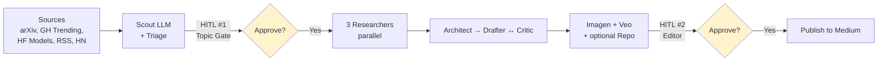

# Public Launch of `gemini-agent-blueprint` Implementation Plan

> **For agentic workers:** REQUIRED SUB-SKILL: Use superpowers:subagent-driven-development (recommended) or superpowers:executing-plans to implement this plan task-by-task. Steps use checkbox (`- [ ]`) syntax for tracking.

**Goal:** Take the existing private repo (`Content Gemini Agent`) and prepare it for public release as `gemini-agent-blueprint`, including a Medium article + tweet thread + LinkedIn post.

**Architecture:** Three layers of changes: (1) light parameterization so all `airel-v2-*` and `ai-release-pipeline-v2` references become driven by a single `var.project_name` (terraform) + two env vars (`PROJECT_DISPLAY_NAME`, `PROJECT_APP_NAME`); (2) cleanup of internal artifacts (`spike/`, `sample/`, `DESIGN.v2.md`, etc.) plus rename `deploy/v2/` → `deploy/terraform/`; (3) new public-facing docs (`README.md`, `docs/ARCHITECTURE.md`, `LICENSE`) and launch assets (`docs/launch/article.md`, `tweet-thread.md`, `linkedin-post.md`).

**Tech Stack:** Python 3.12, uv, ADK 2.0b1, Vertex AI Agent Runtime, Terraform, Mermaid (GitHub-native rendering), Markdown.

**Spec:** `docs/superpowers/specs/2026-05-01-public-launch-design.md`

**Phases:**
1. Parameterization refactor (Tasks 1–4)
2. Cleanup & rename (Tasks 5–6)
3. Public documentation (Tasks 7–10)
4. Launch assets (Tasks 11–15)
5. Pre-publish verification (Task 16, mostly manual)
6. Public push (Task 17, mostly manual)
7. Post-publish cleanup (Tasks 18–19, partly manual)

---

## Phase 1 — Parameterization Refactor

### Task 1: Parameterize `deploy.py`

**Goal:** Replace hardcoded `"ai-release-pipeline-v2"` and `"ai_release_pipeline_v2"` constants with env-var reads. Remove insecure defaults from `GITHUB_ORG` and `TELEGRAM_APPROVAL_CHAT_ID`.

**Files:**
- Modify: `deploy.py`
- Create: `tests/test_deploy_config.py`

- [ ] **Step 1: Write the failing test for env-var reading**

Create `tests/test_deploy_config.py`:

```python
"""Tests for deploy.py configuration reads. We import the helpers so that
deploy.py's main() does not run at import time — main() requires Vertex
SDK init and a GCP project."""

import importlib
import os
from unittest.mock import patch


def _reload_deploy():
    import deploy
    return importlib.reload(deploy)


def test_display_name_default_is_blueprint():
    with patch.dict(os.environ, {}, clear=True):
        deploy = _reload_deploy()
        assert deploy.DISPLAY == "gemini-agent-blueprint"


def test_display_name_overrides_via_env():
    with patch.dict(os.environ, {"PROJECT_DISPLAY_NAME": "my-agent"}, clear=True):
        deploy = _reload_deploy()
        assert deploy.DISPLAY == "my-agent"


def test_app_name_default_is_blueprint():
    with patch.dict(os.environ, {}, clear=True):
        deploy = _reload_deploy()
        assert deploy.APP_NAME == "gemini_agent_blueprint"


def test_app_name_overrides_via_env():
    with patch.dict(os.environ, {"PROJECT_APP_NAME": "my_agent"}, clear=True):
        deploy = _reload_deploy()
        assert deploy.APP_NAME == "my_agent"


def test_project_name_default_is_gab():
    with patch.dict(os.environ, {}, clear=True):
        deploy = _reload_deploy()
        assert deploy.PROJECT_PREFIX == "gab"


def test_project_name_overrides_via_env():
    with patch.dict(os.environ, {"TF_VAR_project_name": "myagent"}, clear=True):
        deploy = _reload_deploy()
        assert deploy.PROJECT_PREFIX == "myagent"
```

- [ ] **Step 2: Run test to verify it fails**

Run: `uv run pytest tests/test_deploy_config.py -v`
Expected: FAIL with `AttributeError: module 'deploy' has no attribute 'APP_NAME'` (or similar — the module currently doesn't expose these constants).

- [ ] **Step 3: Modify `deploy.py` to read env vars**

In `deploy.py`, replace lines 53-56:

```python
# Region pin per §3 — independent of GOOGLE_CLOUD_LOCATION.
REGION  = "us-west1"
DISPLAY = "ai-release-pipeline-v2"
ID_FILE = pathlib.Path("deploy/.deployed_resource_id")
```

with:

```python
# Region pin — independent of GOOGLE_CLOUD_LOCATION. Default us-west1 because
# Vertex AI Agent Runtime requires a regional endpoint and that's where
# the reference deployment lives. Override with REGION env var if needed.
REGION         = os.environ.get("REGION", "us-west1")

# Display name shown in the Vertex AI Agent Runtime console.
DISPLAY        = os.environ.get("PROJECT_DISPLAY_NAME", "gemini-agent-blueprint")

# Internal app_name passed to AdkApp — must be a valid Python identifier
# (no hyphens). Used by the ADK runtime to resolve the agent module.
APP_NAME       = os.environ.get("PROJECT_APP_NAME", "gemini_agent_blueprint")

# Resource-name prefix shared with terraform. Drives SA names, secret
# names, bucket names. Default "gab" matches terraform's var.project_name
# default. If you set TF_VAR_project_name=myagent, set this to match
# (or rely on the auto-pickup from TF_VAR_project_name below).
PROJECT_PREFIX = os.environ.get("TF_VAR_project_name", "gab")

ID_FILE        = pathlib.Path("deploy/.deployed_resource_id")
```

- [ ] **Step 4: Update `deploy.py` body to use new constants**

In `deploy.py` `main()` function, replace these lines:

Old (around line 106):
```python
    sa_email = f"airel-v2-app@{project}.iam.gserviceaccount.com"
    staging_bucket = f"gs://{project}-airel-v2-staging"
```

New:
```python
    sa_email = f"{PROJECT_PREFIX}-app@{project}.iam.gserviceaccount.com"
    staging_bucket = f"gs://{project}-{PROJECT_PREFIX}-staging"
```

Old (around line 127):
```python
    app = agent_engines.AdkApp(
        agent=root_agent,
        app_name="ai_release_pipeline_v2",
        enable_tracing=True,            # Cloud Trace integration (§11.1)
    )
```

New:
```python
    app = agent_engines.AdkApp(
        agent=root_agent,
        app_name=APP_NAME,
        enable_tracing=True,
    )
```

Old (around line 143):
```python
        "GCS_ASSETS_BUCKET":         f"{project}-airel-assets-v2",
```

New:
```python
        "GCS_ASSETS_BUCKET":         f"{project}-{PROJECT_PREFIX}-assets",
```

Old (around line 148):
```python
        "GITHUB_TOKEN": aip_types.SecretRef(
            secret="airel-v2-github-token", version="latest"
        ),
        "TELEGRAM_BOT_TOKEN": aip_types.SecretRef(
            secret="airel-v2-telegram-bot-token", version="latest"
        ),
```

New:
```python
        "GITHUB_TOKEN": aip_types.SecretRef(
            secret=f"{PROJECT_PREFIX}-github-token", version="latest"
        ),
        "TELEGRAM_BOT_TOKEN": aip_types.SecretRef(
            secret=f"{PROJECT_PREFIX}-telegram-bot-token", version="latest"
        ),
```

Old (around line 104):
```python
    github_org = os.environ.get("GITHUB_ORG", "pixelcanon")
    approval_chat = os.environ.get("TELEGRAM_APPROVAL_CHAT_ID", "8481672863")
```

New (remove personal defaults — make required):
```python
    github_org = os.environ.get("GITHUB_ORG")
    if not github_org:
        sys.exit("ERROR: GITHUB_ORG is not set. See .env.example.")
    approval_chat = os.environ.get("TELEGRAM_APPROVAL_CHAT_ID")
    if not approval_chat:
        sys.exit("ERROR: TELEGRAM_APPROVAL_CHAT_ID is not set. See .env.example.")
```

Update the description string in the `agent_engines.create()` call (around line 186):

Old:
```python
            description="AI release → article pipeline (graph workflow + HITL)",
```

New:
```python
            description=f"{DISPLAY} — AI release → article pipeline (graph workflow + HITL)",
```

- [ ] **Step 5: Run tests to verify they pass**

Run: `uv run pytest tests/test_deploy_config.py -v`
Expected: 6 PASSED.

- [ ] **Step 6: Run full test suite to verify no regressions**

Run: `uv run pytest`
Expected: full suite green (89+ tests passing).

- [ ] **Step 7: Commit**

```bash
git add deploy.py tests/test_deploy_config.py
git commit -m "refactor: parameterize deploy.py via env vars

- DISPLAY, APP_NAME, PROJECT_PREFIX, REGION now read from environment
- Defaults: gemini-agent-blueprint, gemini_agent_blueprint, gab, us-west1
- GITHUB_ORG and TELEGRAM_APPROVAL_CHAT_ID become required (no defaults)
- All hardcoded airel-v2-* / ai-release-pipeline-v2 references replaced

Drops personal defaults so a forker can deploy without touching deploy.py."
```

---

### Task 2: Parameterize Terraform via `var.project_name`

**Goal:** Add `var.project_name` (default `"gab"`) to terraform; derive all SA names, secret names, bucket names from it.

**Files:**
- Modify: `deploy/v2/main.tf`
- Modify: `deploy/v2/iam.tf`
- Modify: `deploy/v2/outputs.tf`

- [ ] **Step 1: Read the current terraform files**

Run: `cat deploy/v2/main.tf deploy/v2/iam.tf deploy/v2/outputs.tf`

Note the resources currently named `airel-v2-app`, `airel-v2-github-token`, `airel-v2-telegram-bot-token`, `airel-v2-telegram-webhook-secret`, `airel-v2-staging`, `airel-assets-v2`, `airel-v2-telegram-bridge`, `airel-v2-scheduler`. Each becomes parameterized below.

- [ ] **Step 2: Add `var.project_name` declaration in `main.tf`**

At the top of `deploy/v2/main.tf` (above any `resource` blocks; below `terraform { ... }` and `provider { ... }` blocks), add:

```hcl
variable "project_name" {
  description = "Resource-name prefix shared with deploy.py (PROJECT_PREFIX env var). Drives SA names, secret names, bucket names. Default 'gab' = gemini-agent-blueprint."
  type        = string
  default     = "gab"
  validation {
    condition     = can(regex("^[a-z][a-z0-9-]{1,28}$", var.project_name))
    error_message = "project_name must be 2-29 chars, lowercase letters/digits/hyphens, starting with a letter."
  }
}

variable "project" {
  description = "GCP project ID."
  type        = string
}

variable "github_token" {
  description = "GitHub PAT with repo scope. Stored in Secret Manager."
  type        = string
  sensitive   = true
}

variable "telegram_bot_token" {
  description = "Telegram bot token. Stored in Secret Manager."
  type        = string
  sensitive   = true
}

locals {
  sa_app             = "${var.project_name}-app"
  sa_bridge          = "${var.project_name}-telegram-bridge"
  sa_scheduler       = "${var.project_name}-scheduler"
  secret_github      = "${var.project_name}-github-token"
  secret_telegram    = "${var.project_name}-telegram-bot-token"
  secret_webhook     = "${var.project_name}-telegram-webhook-secret"
  bucket_assets      = "${var.project}-${var.project_name}-assets"
  bucket_staging     = "${var.project}-${var.project_name}-staging"
}
```

(If any of these variables already exist, leave them — only add the missing ones.)

- [ ] **Step 3: Replace hardcoded resource names in `main.tf`**

In `deploy/v2/main.tf`, find each `airel-v2-*` / `airel-assets-v2` literal in resource definitions and replace as follows:

| Find | Replace |
|---|---|
| `name = "airel-v2-app"` | `name = local.sa_app` (in `google_service_account` resource) |
| `name = "airel-v2-telegram-bridge"` | `name = local.sa_bridge` |
| `name = "airel-v2-scheduler"` | `name = local.sa_scheduler` |
| `secret_id = "airel-v2-github-token"` | `secret_id = local.secret_github` |
| `secret_id = "airel-v2-telegram-bot-token"` | `secret_id = local.secret_telegram` |
| `secret_id = "airel-v2-telegram-webhook-secret"` | `secret_id = local.secret_webhook` |
| `name = "${var.project}-airel-v2-staging"` | `name = local.bucket_staging` |
| `name = "${var.project}-airel-assets-v2"` | `name = local.bucket_assets` |

Do the same replacement in any IAM-binding `member` strings that hardcode SA emails — e.g.:

| Find | Replace |
|---|---|
| `serviceAccount:airel-v2-app@${var.project}.iam.gserviceaccount.com` | `serviceAccount:${local.sa_app}@${var.project}.iam.gserviceaccount.com` |
| `serviceAccount:airel-v2-telegram-bridge@${var.project}.iam.gserviceaccount.com` | `serviceAccount:${local.sa_bridge}@${var.project}.iam.gserviceaccount.com` |
| `serviceAccount:airel-v2-scheduler@${var.project}.iam.gserviceaccount.com` | `serviceAccount:${local.sa_scheduler}@${var.project}.iam.gserviceaccount.com` |

- [ ] **Step 4: Replace hardcoded names in `iam.tf`**

Apply the same find/replace in `deploy/v2/iam.tf` (same patterns as Step 3).

- [ ] **Step 5: Update `outputs.tf` to expose derived names**

Replace the existing `deploy/v2/outputs.tf` contents with:

```hcl
output "service_account_app" {
  description = "Email of the Agent Runtime SA."
  value       = "${local.sa_app}@${var.project}.iam.gserviceaccount.com"
}

output "service_account_bridge" {
  description = "Email of the Telegram bridge Cloud Run SA."
  value       = "${local.sa_bridge}@${var.project}.iam.gserviceaccount.com"
}

output "service_account_scheduler" {
  description = "Email of the Cloud Scheduler SA."
  value       = "${local.sa_scheduler}@${var.project}.iam.gserviceaccount.com"
}

output "bucket_assets" {
  description = "Public-read GCS bucket for image/video assets."
  value       = local.bucket_assets
}

output "bucket_staging" {
  description = "GCS bucket for Vertex SDK source-tarball uploads."
  value       = local.bucket_staging
}

output "secret_github_token_id" {
  description = "Secret Manager ID for the GitHub PAT."
  value       = local.secret_github
}

output "secret_telegram_bot_token_id" {
  description = "Secret Manager ID for the Telegram bot token."
  value       = local.secret_telegram
}

output "secret_webhook_secret_id" {
  description = "Secret Manager ID for the Telegram webhook verification secret."
  value       = local.secret_webhook
}

output "telegram_webhook_secret_value" {
  description = "Plaintext value of the Telegram webhook secret (use to register the webhook with Telegram)."
  value       = random_password.telegram_webhook_secret.result
  sensitive   = true
}

output "project_name" {
  description = "The resource-name prefix in use. Pass to deploy.py via TF_VAR_project_name or PROJECT_PREFIX."
  value       = var.project_name
}
```

(If `random_password.telegram_webhook_secret` is not yet defined in your `main.tf`, the previous step's `outputs.tf` will have referenced its prior name — keep that consistent. Read both files to verify.)

- [ ] **Step 6: Verify with `terraform validate`**

Run: `cd deploy/v2 && terraform init -backend=false && terraform validate`
Expected: `Success! The configuration is valid.`

- [ ] **Step 7: Verify with `terraform plan` using a synthetic var**

Run: `cd deploy/v2 && terraform plan -var=project_name=test -var=project=test-project -var=github_token=fake -var=telegram_bot_token=fake`
Expected: plan completes (some IAM resources may flag because the project doesn't exist, but no template/syntax errors).

- [ ] **Step 8: Commit**

```bash
git add deploy/v2/main.tf deploy/v2/iam.tf deploy/v2/outputs.tf
git commit -m "refactor: parameterize terraform via var.project_name

All airel-v2-* / airel-assets-v2 hardcoded resource names replaced with
locals derived from var.project_name (default 'gab'). Outputs exposed
for deploy.py consumption.

Validation: terraform validate + terraform plan -var=project_name=test
both pass."
```

---

### Task 3: Parameterize `agent.py` workflow name

**Goal:** Replace the hardcoded `name="ai_release_pipeline_v2"` in `Workflow(...)` with a read from `PROJECT_APP_NAME`.

**Files:**
- Modify: `agent.py`
- Modify: `tests/test_graph_shape.py` (or add a new test if the current one hardcodes the name)

- [ ] **Step 1: Read the relevant test file**

Run: `grep -n "ai_release_pipeline_v2" tests/test_graph_shape.py tests/*.py local_run.py 2>&1`

Note all locations where the literal appears. Each location must either be parameterized or asserted against a default.

- [ ] **Step 2: Write the failing test for env-driven workflow name**

Add to `tests/test_graph_shape.py` (or create `tests/test_agent_config.py` if cleaner):

```python
import importlib
import os
from unittest.mock import patch


def test_workflow_name_default_is_gemini_agent_blueprint():
    with patch.dict(os.environ, {}, clear=True):
        # Re-import agent so module-level Workflow() uses the patched env.
        import agent
        importlib.reload(agent)
        assert agent.root_agent.name == "gemini_agent_blueprint"


def test_workflow_name_overrides_via_env():
    with patch.dict(os.environ, {"PROJECT_APP_NAME": "my_workflow"}, clear=True):
        import agent
        importlib.reload(agent)
        assert agent.root_agent.name == "my_workflow"
```

- [ ] **Step 3: Run test to verify it fails**

Run: `uv run pytest tests/test_agent_config.py -v` (or wherever the new tests are)
Expected: FAIL — `agent.root_agent.name` currently equals `"ai_release_pipeline_v2"`, not `"gemini_agent_blueprint"`.

- [ ] **Step 4: Modify `agent.py`**

Add at the top of `agent.py` (just under the docstring, above the imports — or right after the existing imports, whichever fits the style):

```python
import os
```

Replace:

```python
root_agent = Workflow(
    name="ai_release_pipeline_v2",
    state_schema=PipelineState,
    edges=[
```

with:

```python
root_agent = Workflow(
    name=os.environ.get("PROJECT_APP_NAME", "gemini_agent_blueprint"),
    state_schema=PipelineState,
    edges=[
```

- [ ] **Step 5: Run the new tests to verify they pass**

Run: `uv run pytest tests/test_agent_config.py -v`
Expected: 2 PASSED.

- [ ] **Step 6: Update `local_run.py` to use the env-driven name**

In `local_run.py`, find the two places that pass `app_name="ai_release_pipeline_v2"` (around lines 141 and 142, plus 144-146, plus 196):

Old:
```python
    runner = InMemoryRunner(agent=root_agent, app_name="ai_release_pipeline_v2")
    sess = await runner.session_service.create_session(
        app_name="ai_release_pipeline_v2", user_id="local-exercise"
    )
```

New:
```python
    app_name = os.environ.get("PROJECT_APP_NAME", "gemini_agent_blueprint")
    runner = InMemoryRunner(agent=root_agent, app_name=app_name)
    sess = await runner.session_service.create_session(
        app_name=app_name, user_id="local-exercise"
    )
```

And similarly the `runner.session_service.get_session(...)` call near line 196:

Old:
```python
    final = await runner.session_service.get_session(
        app_name="ai_release_pipeline_v2",
        user_id="local-exercise",
        session_id=sess.id,
    )
```

New:
```python
    final = await runner.session_service.get_session(
        app_name=app_name,
        user_id="local-exercise",
        session_id=sess.id,
    )
```

- [ ] **Step 7: Run the full test suite**

Run: `uv run pytest`
Expected: full suite green.

- [ ] **Step 8: Verify `local_run.py` still works (smoke test)**

Run: `PYTHONPATH=. uv run python local_run.py 2>&1 | head -30`
Expected: Mocks installed line + a "Workflow: gemini_agent_blueprint" or similar workflow summary line. (You don't have to let it run to completion; just verify the workflow constructs without error.)

- [ ] **Step 9: Commit**

```bash
git add agent.py local_run.py tests/test_agent_config.py
git commit -m "refactor: parameterize Workflow name via PROJECT_APP_NAME

agent.py and local_run.py now read PROJECT_APP_NAME from env (default
gemini_agent_blueprint). Default chosen to match deploy.py and terraform.
Two new unit tests cover the default + override behavior."
```

---

### Task 4: Update `.env.example`, `deploy/v2/README.md`, and the operator runbook

**Goal:** `.env.example` and the runbook reflect the new env vars + terraform vars. Reader can copy-paste their way through.

**Files:**
- Modify: `.env.example`
- Modify: `deploy/v2/README.md`

- [ ] **Step 1: Update `.env.example`**

Replace the contents of `.env.example` with:

```bash
# Google Cloud / Vertex AI
GOOGLE_CLOUD_PROJECT=          # Your GCP project ID
GOOGLE_CLOUD_LOCATION=us-central1
GOOGLE_GENAI_USE_VERTEXAI=true

# Project naming — must match terraform var.project_name (default "gab")
TF_VAR_project_name=gab        # Drives all SA / secret / bucket names. 2-29 chars, [a-z0-9-], starts with letter.
PROJECT_DISPLAY_NAME=gemini-agent-blueprint  # Shown in Vertex AI Agent Runtime console
PROJECT_APP_NAME=gemini_agent_blueprint      # ADK app_name; must be valid Python identifier (no hyphens)

# Optional — override the default us-west1 region (Vertex AI Agent Runtime requires regional endpoint)
# REGION=us-west1

# GitHub (Repo Builder + GitHub researcher) — REQUIRED, no defaults
GITHUB_TOKEN=                  # PAT with `repo` scope. Used by repo_builder + github_researcher.
GITHUB_ORG=                    # GitHub org or username under which repos will be created.

# Telegram (Topic Gate + Editor approval) — REQUIRED, no defaults
TELEGRAM_BOT_TOKEN=            # From @BotFather. Same value also goes into Secret Manager.
TELEGRAM_APPROVAL_CHAT_ID=     # Chat ID where approval messages are posted (numeric, can be negative for groups).

# Cloud Storage (image/video asset hosting) — set to terraform output bucket_assets
GCS_ASSETS_BUCKET=             # Format: ${GOOGLE_CLOUD_PROJECT}-${TF_VAR_project_name}-assets
```

- [ ] **Step 2: Verify `.env.example` is syntactically valid**

Run: `set -a && source .env.example && set +a && echo "OK"`
Expected: `OK` (the file sources cleanly; values are blank but the syntax is correct).

- [ ] **Step 3: Update `deploy/v2/README.md` runbook**

Read the file: `cat deploy/v2/README.md`

Find references to `airel-v2-*` resource names and replace each with the corresponding parameterized form. Specifically:
- "Resource bucket `${PROJECT}-airel-assets-v2`" → "`${PROJECT}-${TF_VAR_project_name}-assets`"
- "Resource bucket `${PROJECT}-airel-v2-staging`" → "`${PROJECT}-${TF_VAR_project_name}-staging`"
- "Secret `airel-v2-github-token`" → "`${TF_VAR_project_name}-github-token`"
- "Secret `airel-v2-telegram-bot-token`" → "`${TF_VAR_project_name}-telegram-bot-token`"
- "Secret `airel-v2-telegram-webhook-secret`" → "`${TF_VAR_project_name}-telegram-webhook-secret`"
- "SA `airel-v2-app`" → "`${TF_VAR_project_name}-app`"
- "SA `airel-v2-telegram-bridge`" → "`${TF_VAR_project_name}-telegram-bridge`"
- "SA `airel-v2-scheduler`" → "`${TF_VAR_project_name}-scheduler`"
- All inline gcloud/terraform commands that hardcoded `airel-v2-*`: rewrite to use the variable.

Add a new "Phase 0 — Set your variables" section at the top, right after "What this module creates" and before "Required APIs":

````markdown
## Phase 0 — Set your variables

This terraform module is parameterized via `var.project_name`. Set it (and the
secrets it consumes) before running anything below:

```bash
# Choose a short prefix for your resources. 2-29 chars, lowercase letters,
# digits, hyphens. This drives all SA / secret / bucket names.
export TF_VAR_project_name=gab            # default; rename for your fork

# Required GCP project (no default).
export TF_VAR_project=$(echo $GOOGLE_CLOUD_PROJECT)

# Required secret-backed values (read once from .env or your shell).
export TF_VAR_github_token=$(grep -E '^GITHUB_TOKEN=' ../../.env | cut -d= -f2-)
export TF_VAR_telegram_bot_token=$(grep -E '^TELEGRAM_BOT_TOKEN=' ../../.env | cut -d= -f2-)
```

Set the matching env vars for `deploy.py` (Phase 3):

```bash
export PROJECT_DISPLAY_NAME=gemini-agent-blueprint
export PROJECT_APP_NAME=gemini_agent_blueprint
# TF_VAR_project_name doubles as PROJECT_PREFIX for deploy.py.
```
````

Also update the Cloud Run deploy command in Phase 4 (around the `gcloud run deploy ai-release-pipeline-v2-telegram` invocation):

Old:
```bash
gcloud run deploy ai-release-pipeline-v2-telegram \
```

New:
```bash
gcloud run deploy "${TF_VAR_project_name}-telegram" \
```

And the scheduler job names in Phase 5:

Old:
```bash
gcloud scheduler jobs create http ai-release-pipeline-v2-hourly \
```

New:
```bash
gcloud scheduler jobs create http "${TF_VAR_project_name}-hourly" \
```

(Apply the same pattern to `ai-release-pipeline-v2-hitl-sweeper` → `"${TF_VAR_project_name}-hitl-sweeper"`.)

- [ ] **Step 4: Verify the runbook still grep-clean for old names**

Run: `grep -n "airel-v2\|ai-release-pipeline-v2" deploy/v2/README.md || echo "CLEAN"`
Expected: `CLEAN`. If any matches remain, fix them in this step.

- [ ] **Step 5: Commit**

```bash
git add .env.example deploy/v2/README.md
git commit -m "docs: update .env.example and runbook for parameterization

.env.example documents TF_VAR_project_name, PROJECT_DISPLAY_NAME, PROJECT_APP_NAME
explicitly, removes personal defaults. Runbook gets a Phase 0 'set your variables'
section + parameterized resource names throughout."
```

---

## Phase 2 — Cleanup & Rename

### Task 5: Delete obsolete files

**Goal:** Remove `spike/`, `sample/`, `DESIGN.v2.md`, `deploy/v2/tfplan`, plus stale terraform state if present.

**Files:**
- Delete: `spike/` (entire directory)
- Delete: `sample/` (entire directory)
- Delete: `DESIGN.v2.md`
- Delete: `deploy/v2/tfplan`

- [ ] **Step 1: Verify what's tracked under each path**

Run: `git ls-files spike/ sample/ DESIGN.v2.md deploy/v2/tfplan 2>&1`
Expected: outputs of all tracked files in those paths. Note the file count.

- [ ] **Step 2: Delete the directories and files**

Run:
```bash
git rm -rf spike/ sample/ DESIGN.v2.md deploy/v2/tfplan
```

Expected: each removal logged.

- [ ] **Step 3: Verify nothing references the deleted paths**

Run: `grep -r "DESIGN.v2.md\|spike/\|sample/" --include="*.py" --include="*.md" --include="*.toml" . 2>/dev/null | grep -v "^./docs/superpowers/" | grep -v "^Binary"`
Expected: only the `pyproject.toml` `readme = "DESIGN.v2.md"` line (we'll fix in Task 8) and references inside `docs/superpowers/` (which gets cleaned up at the end). Anything else is unexpected — investigate.

- [ ] **Step 4: Run the full test suite to verify no regressions**

Run: `uv run pytest`
Expected: full suite green.

- [ ] **Step 5: Commit**

```bash
git commit -m "chore: remove internal artifacts (spike, sample, DESIGN.v2.md, tfplan)

- spike/ — exploration scripts; their findings migrate into the article
- sample/ — personal Telegram screenshots; one redacted version goes
  to docs/img/hitl-telegram.png in a later task
- DESIGN.v2.md — internal contract doc with TBDs/drafting markers;
  replaced by docs/ARCHITECTURE.md (next phase)
- deploy/v2/tfplan — stale binary terraform plan, regenerated by
  terraform plan as needed"
```

---

### Task 6: Rename `deploy/v2/` → `deploy/terraform/`

**Goal:** Rename the terraform module directory to a less-internal name.

**Files:**
- Rename: `deploy/v2/` → `deploy/terraform/`
- Modify: any code/docs that reference `deploy/v2/` path

- [ ] **Step 1: Find all references to the old path**

Run: `grep -rn "deploy/v2" --include="*.py" --include="*.md" --include="*.tf" --include="*.toml" . 2>/dev/null | grep -v ".git"`
Expected: list of all files that reference `deploy/v2`. Capture this list — Step 4 must update each.

- [ ] **Step 2: Rename the directory in git**

Run: `git mv deploy/v2 deploy/terraform`
Expected: rename completes silently.

- [ ] **Step 3: Verify directory contents moved**

Run: `ls deploy/terraform/`
Expected: `README.md  iam.tf  main.tf  outputs.tf` (and possibly `.gitignore`, `.terraform.lock.hcl`).

Run: `[ -d deploy/v2 ] && echo "OOPS still exists" || echo "OK"`
Expected: `OK`.

- [ ] **Step 4: Update path references in tracked files**

For every file from Step 1's grep, update the path reference:
- `deploy.py`: line referencing `deploy/.deployed_resource_id` is FINE (the inner path didn't change). But check the docstring if it says `deploy/v2/` — update to `deploy/terraform/`.
- `deploy/terraform/README.md` (formerly `deploy/v2/README.md`): all internal references to "deploy/v2/" → "deploy/terraform/".
- Any other files that pop up in Step 1.

Run: `grep -rn "deploy/v2" --include="*.py" --include="*.md" --include="*.tf" --include="*.toml" . 2>/dev/null | grep -v ".git" | grep -v "^./docs/superpowers/"`
Expected: only `docs/superpowers/` matches remain (specs/plans — they'll be deleted later). Anything else needs fixing.

- [ ] **Step 5: Run full test suite**

Run: `uv run pytest`
Expected: green.

- [ ] **Step 6: Verify terraform still validates from the new location**

Run: `cd deploy/terraform && terraform init -backend=false -reconfigure && terraform validate`
Expected: `Success! The configuration is valid.`

- [ ] **Step 7: Commit**

```bash
git add -A
git commit -m "chore: rename deploy/v2 -> deploy/terraform

deploy/v2 was an internal versioning name carried over from the v1->v2
rebuild. deploy/terraform is what it actually is — a terraform module —
and aligns better for public consumption."
```

---

## Phase 3 — Public Documentation

### Task 7: Add `LICENSE` (MIT)

**Goal:** Add MIT license file.

**Files:**
- Create: `LICENSE`

- [ ] **Step 1: Get the user's name from git config**

Run: `git config user.name`
Expected output: e.g., `foodlbs`. Capture this for the LICENSE.

If the user has a preferred display name different from their git username (e.g., "Rahul Patel"), use that. Default to the git username.

- [ ] **Step 2: Create `LICENSE`**

Create `LICENSE` with the standard MIT text. Use 2026 as the year and the user's name from Step 1:

```
MIT License

Copyright (c) 2026 Rahul Patel

Permission is hereby granted, free of charge, to any person obtaining a copy
of this software and associated documentation files (the "Software"), to deal
in the Software without restriction, including without limitation the rights
to use, copy, modify, merge, publish, distribute, sublicense, and/or sell
copies of the Software, and to permit persons to whom the Software is
furnished to do so, subject to the following conditions:

The above copyright notice and this permission notice shall be included in all
copies or substantial portions of the Software.

THE SOFTWARE IS PROVIDED "AS IS", WITHOUT WARRANTY OF ANY KIND, EXPRESS OR
IMPLIED, INCLUDING BUT NOT LIMITED TO THE WARRANTIES OF MERCHANTABILITY,
FITNESS FOR A PARTICULAR PURPOSE AND NONINFRINGEMENT. IN NO EVENT SHALL THE
AUTHORS OR COPYRIGHT HOLDERS BE LIABLE FOR ANY CLAIM, DAMAGES OR OTHER
LIABILITY, WHETHER IN AN ACTION OF CONTRACT, TORT OR OTHERWISE, ARISING FROM,
OUT OF OR IN CONNECTION WITH THE SOFTWARE OR THE USE OR OTHER DEALINGS IN THE
SOFTWARE.
```

- [ ] **Step 3: Verify**

Run: `head -3 LICENSE`
Expected: `MIT License`, blank line, `Copyright (c) 2026 Rahul Patel`.

- [ ] **Step 4: Commit**

```bash
git add LICENSE
git commit -m "chore: add MIT LICENSE"
```

---

### Task 8: Update `pyproject.toml`

**Goal:** Reset version, rename project, point readme at the new README.md.

**Files:**
- Modify: `pyproject.toml`

- [ ] **Step 1: Read current `pyproject.toml`**

Run: `cat pyproject.toml`

- [ ] **Step 2: Update fields**

In `pyproject.toml`, replace:

Old:
```toml
[project]
name = "ai-release-pipeline"
version = "2.0.0"
description = "AI release → article pipeline on ADK 2.0 + Agent Runtime"
readme = "DESIGN.v2.md"
requires-python = ">=3.12"
```

New:
```toml
[project]
name = "gemini-agent-blueprint"
version = "0.1.0"
description = "Production-grade reference architecture for Gemini Agent Platform — graph workflow, HITL, Memory Bank, end-to-end on ADK 2.0 + Vertex AI Agent Runtime."
readme = "README.md"
license = { text = "MIT" }
requires-python = ">=3.12"
```

(The rest of the file — dependencies, dependency-groups, tool.pytest.ini_options — stays unchanged.)

- [ ] **Step 3: Verify uv sync still works**

Run: `uv sync`
Expected: completes without errors. (Doesn't matter if "Installed N packages" or "Already up-to-date" — only that it doesn't error.)

- [ ] **Step 4: Run the full test suite**

Run: `uv run pytest`
Expected: green.

- [ ] **Step 5: Commit**

```bash
git add pyproject.toml
git commit -m "chore: rename project to gemini-agent-blueprint, reset version 0.1.0

- name: ai-release-pipeline -> gemini-agent-blueprint
- version: 2.0.0 -> 0.1.0 (fresh public start)
- description: rewritten for public audience
- readme: DESIGN.v2.md -> README.md (DESIGN.v2.md was deleted; README.md
  comes in the next task)
- license: MIT (matches LICENSE file)"
```

---

### Task 9: Write `docs/ARCHITECTURE.md`

**Goal:** Distill the deleted `DESIGN.v2.md` into a public-facing architecture doc (~7,500 words across 11 sections).

**Files:**
- Create: `docs/ARCHITECTURE.md`

**Source material:** This is a single large doc-writing task. The source content is the (now-deleted) `DESIGN.v2.md` — recover it from git history if needed:

```bash
git show HEAD~10:DESIGN.v2.md > /tmp/design.v2.md  # adjust HEAD~N if needed; use git log to find the commit before deletion
```

- [ ] **Step 1: Recover DESIGN.v2.md content**

Run: `git log --all --oneline -- DESIGN.v2.md | head -5`
Expected: list of commits that touched it. Pick the most recent commit before the deletion in Task 5.

Run: `git show <commit-hash>:DESIGN.v2.md > /tmp/design.v2.md && wc -l /tmp/design.v2.md`
Expected: ~5800 lines.

- [ ] **Step 2: Create the file with title + Section 1 (Overview & problem statement, ~400 words)**

Create `docs/ARCHITECTURE.md` starting with:

````markdown
# Architecture — `gemini-agent-blueprint`

A production graph workflow on Google's Gemini Agent Platform. This document explains the design at depth — how the pipeline is shaped, why, and where the interesting tradeoffs live.

If you haven't yet, start with the [README](../README.md) for the high-level overview. The full story behind the design — including the v1 failure that drove it — lives in the [Medium article](<MEDIUM_URL>).

---

## 1. Overview & problem statement

The agent's job is mechanical: poll seven sources for new AI releases, pick the most interesting one, write an article about it, generate cover art and a short demo video, optionally produce an example GitHub repo, and post the article to Medium. Two human-approval gates over Telegram bracket the work — Topic Gate (after triage, before research) and Editor (after writing, before publish).

The architectural problem is the gap between three constraints that don't fit together on serverless infrastructure:

- **Gate 1 + Gate 2 take up to 24 hours each.** Humans tap Approve when they have a free moment, not when an HTTP request is waiting.
- **Cloud Run requests cap at 60 minutes.** Anything held open longer is killed by the platform.
- **State must persist across the pause.** A new HTTP request can't restart from scratch — the workflow has 20+ nodes of accumulated state.

The v1 architecture put the entire pipeline in a single Cloud Run request and tried to extend the timeout. It deployed cleanly. It produced zero articles in three weeks of running, because every cycle hit the 60-minute cap and dropped its state.

The v2 architecture (this codebase) uses ADK 2.0's `Workflow` graph as a *suspended generator*. When a node yields `RequestInput`, the workflow's state is written to durable storage and the request is released. The resume comes via a separate message-event matched on `interrupt_id` — no HTTP request is held. The 24-hour gate cost goes from "kills the workflow" to "free."

This document walks through the resulting design.

### What this is NOT

- Not a chat agent — there's no conversation; the workflow runs end-to-end and pauses only at the two gates.
- Not a real-time agent — it polls hourly via Cloud Scheduler and produces at most one article per cycle.
- Not multi-tenant — one user, one Telegram chat, one Medium account.

---
````

- [ ] **Step 3: Add Section 2 (The workflow graph, ~800 words)**

Append to `docs/ARCHITECTURE.md`:

````markdown
## 2. The workflow graph

The whole pipeline is a single `Workflow(...)` declared in `agent.py`. Five phases:



ADK 2.0's `Workflow` takes an `edges` list — each entry is a tuple of nodes that get chained together. The structure mirrors the graph above, with three patterns worth understanding.

### Pattern 1 — Dict-edge routing

A function node sets `ctx.route = "BRANCH"` to choose its successor. The dict-form edge then maps the route value to the next node:

```python
(triage, route_after_triage, {
    "SKIP":     record_triage_skip,
    "CONTINUE": topic_gate_request,
})
```

After `triage` runs, `route_after_triage` reads its decision and sets `ctx.route = "SKIP"` or `"CONTINUE"`. The runner picks the corresponding successor.

**Gotcha that cost a half-day during the v2 rebuild:** routes are emitted by setting `ctx.route`, *not* by `Event(output="BRANCH")`. The official ambient-expense-agent sample is misleading on this — it returns `Event(output="AUTO_APPROVE")`, which only works if no dict-edge depends on routing. If you've copied that pattern and your routes don't fire, this is why.

### Pattern 2 — Tuple fan-out (parallel execution)

A tuple as the dict-edge value triggers all listed nodes in parallel:

```python
(topic_gate_request, record_topic_verdict, route_topic_verdict, {
    "approve":  (docs_researcher, github_researcher, context_researcher),
    ...
})
```

When `route_topic_verdict` resolves to `"approve"`, all three researchers start concurrently. They share the same upstream state but write to different keys.

**This is fan-out only — there is no fan-in.** ADK 2.0 does not provide a barrier primitive that waits for N parallel branches to complete before continuing. If you need one, you build it (see Pattern 3).

### Pattern 3 — JoinFunctionNode (fan-in barrier)

`nodes/_join_node.py` defines `JoinFunctionNode`, a counter-gated function node that increments on each upstream arrival and only proceeds when the count reaches the expected fan-out:

```python
class JoinFunctionNode(FunctionNode):
    expected: int

    def execute(self, ctx):
        ctx.state.gather_research_call_count = (
            ctx.state.gather_research_call_count + 1
        )
        if ctx.state.gather_research_call_count < self.expected:
            ctx.route = "WAIT"  # don't proceed yet
            return
        # All N arrivals counted — proceed.
        ...
```

This is how `gather_research` waits for all three researchers to finish before architect picks up. Without it, architect would run on the first arrival's partial state.

### The full edge list

The `agent.py` `edges=[...]` list is the canonical control-flow document. Twelve top-level edges define the graph:

```python
("START", scout, scout_split, triage, route_after_triage, {...}),
(topic_gate_request, record_topic_verdict, route_topic_verdict, {...}),
(docs_researcher,    gather_research),
(github_researcher,  gather_research),
(context_researcher, gather_research),
(gather_research, architect_llm, architect_split, drafter,
                                 critic_llm, critic_split,
                                 route_critic_verdict, {...}),
(image_asset_node, video_asset_or_skip, gather_assets),
(gather_assets, route_needs_repo, {...}),
(repo_builder, editor_request),
(editor_request, record_editor_verdict, route_editor_verdict, {...}),
(revision_writer, editor_request),  # loop
```

Read it top-to-bottom; that's the order of execution for the happy path.

---
````

- [ ] **Step 4: Add Section 3 (State schema, ~400 words)**

Read `shared/models.py` first to ground the content in actual code:

```bash
cat shared/models.py
```

Append to `docs/ARCHITECTURE.md`:

````markdown
## 3. State schema

State is a single Pydantic model — `PipelineState` in `shared/models.py` — passed through every node by reference (modulo persistence). Typed fields catch class of bugs that dict-state silently allowed in v1.

Key fields, grouped by phase:

| Phase | Fields | Notes |
|---|---|---|
| Polling | `scout_raw: str` | Raw markdown-fenced JSON from Scout LLM |
| Polling | `candidates: list[Candidate]` | Parsed by `scout_split` function node |
| Triage | `chosen_release: Candidate \| None` | None means "skip cycle" |
| HITL #1 | `topic_verdict: Literal["approve","skip","timeout"]` | Set by `record_topic_verdict` |
| Research | `docs_research / github_research / context_research: str` | One field per parallel researcher |
| Research | `gather_research_call_count: int = 0` | Counter for `JoinFunctionNode` barrier |
| Writer | `outline / draft / critic_verdict` | Populated through the writer loop |
| Writer | `writer_iterations: int` | Capped at 3 to prevent runaway |
| Assets | `image_assets: list[ImageAsset]` | URLs after Imagen + GCS upload |
| Assets | `video_url: str \| None` | None if Veo skipped |
| Repo | `needs_repo: bool` / `repo_url: str \| None` | Set by Architect's outline |
| HITL #2 | `editor_verdict: Literal["approve","reject","revise","timeout"]` | |
| Final | `cycle_outcome: Literal[...]` | Terminal status |

### The dict-vs-model rehydration gotcha

State is persisted to the Vertex AI session store between events. Pydantic models survive the round-trip, but as **dicts**, not as model instances. Code that does `state.chosen_release.title` works the first time; the second time, after rehydration, it crashes with `AttributeError: 'dict' object has no attribute 'title'`.

The fix is a small helper used in `nodes/hitl.py` and any other node that reads model fields:

```python
def _attr(obj, key, default=None):
    """Return obj[key] or obj.key — works for both dicts and pydantic models."""
    if isinstance(obj, dict):
        return obj.get(key, default)
    return getattr(obj, key, default)
```

Use this anywhere you read a Pydantic field that came back from session storage.

---
````

- [ ] **Step 5: Add Section 4 (Per-phase walkthrough, ~2,500 words across 5 subsections)**

Read the relevant code first:
```bash
ls agents/ nodes/ tools/
cat agents/scout.py agents/triage.py
```

Append a 5-subsection section. Each subsection ~500 words. The structure (write each subsection in turn):

**Section 4.1 — Phase 1: Polling, Scout, Triage**
- 7 pollers (arXiv, GH Trending, HF Models, HF Papers, RSS, HN, Anthropic news) — list each with one-line of what it returns
- Scout LLM produces markdown-fenced JSON; `scout_split` parses it
- Triage scores against Memory Bank, picks one or skips
- Why split LLM-output-parsing into a function node: keeps Scout's instruction simple, parser failures don't retry the LLM call

**Section 4.2 — Phase 2: Topic Gate (HITL #1)** ★
- `topic_gate_request` yields `RequestInput`
- Telegram side: posts message with callback_data buttons (64-byte cap → use prefix encoding)
- Resume: bridge service receives `callback_query` → POSTs `FunctionResponse` Part to AdkApp
- 24-hour timeout via HITL sweeper (Cloud Scheduler 15-min cron hits `/sweeper/escalate`)
- Why this works on Cloud Run: pause does NOT hold an HTTP request open

**Section 4.3 — Phase 3: Research → Architect → Writer loop**
- 3 parallel researchers via tuple fan-out
- `gather_research` is a `JoinFunctionNode` (counter-gated) for the fan-in barrier
- Architect produces JSON outline → `architect_split` parses to typed state
- Drafter ↔ Critic loop, max 3 iterations, `route_critic_verdict` chooses REVISE vs ACCEPT

**Section 4.4 — Phase 4: Asset chain + Repo** ★ (the cleanest war story)
- Image gen via Imagen — function node, NOT LlmAgent
- Why: raw PNG bytes accumulating in tool-call history blew the 1M-token cap on the second Imagen call
- Sequential chain (image → video → gather_assets) instead of tuple fan-out: video is fast, tuple let it finish first and trigger gather_assets prematurely
- Repo router: `needs_repo` flag → `repo_builder` or skip; PyGithub creates repo + commits + topics

**Section 4.5 — Phase 5: Editor (HITL #2) + Publish**
- Same RequestInput/Telegram pattern as Topic Gate
- 4 outcomes: approve / reject / revise / timeout
- revise → revision_writer → loop back to editor_request
- approve → publisher posts to Medium API
- reject → terminal (Memory Bank fact written)

Write each subsection as roughly 500 words of running prose, using the bullet list above as scaffolding. Reference actual file paths (`agents/scout.py`, `nodes/aggregation.py`) to ground claims.

- [ ] **Step 6: Add Section 5 (HITL contract — the protocol, ~1,000 words)**

This is the standalone-worthy section. Append:

````markdown
## 5. HITL contract — the protocol

This is the architecturally interesting bit. ADK 2.0's `RequestInput` makes 24-hour human-in-the-loop possible on serverless infrastructure by treating the workflow as a suspended generator instead of an HTTP wait.

### The flow

```mermaid
sequenceDiagram
    participant W as Workflow
    participant A as AdkApp / Agent Runtime
    participant T as Telegram
    participant H as Human
    participant B as Bridge (Cloud Run)

    W->>W: yield RequestInput(interrupt_id, payload, message)
    A->>A: persist state, release request
    W->>T: post message with callback_data buttons
    Note over W,T: Workflow is now suspended.<br/>No HTTP request held.
    H->>T: tap Approve (~24h later)
    T->>B: POST /telegram/webhook (callback_query)
    B->>B: lookup full session_id + interrupt_id from Firestore
    B->>A: POST FunctionResponse Part to AdkApp
    A->>W: resume from suspension; ctx.route = "approve"
```

### `RequestInput` shape

A node yields a `RequestInput` instance with four fields:

```python
yield RequestInput(
    interrupt_id="topic_gate__sess_abc123",  # unique within the session
    payload={"chosen": chosen.model_dump()}, # arbitrary JSON for the Telegram side
    message="Approve this topic?",           # human-readable
    response_schema=TopicVerdict,            # pydantic schema the response will validate against
)
```

The runner persists state, marks the workflow as awaiting input, and releases the request. The next event delivered to this session resumes from this point.

### Telegram callback_data 64-byte cap

Telegram inline-keyboard `callback_data` is capped at 64 bytes. Our session IDs (UUID4) and interrupt IDs (descriptive names) are too long to pack in directly. The encoding compresses to a prefix-only form:

```
sess_pref|choice|intr_pref
```

A short Firestore lookup (`airel_v2_sessions` collection) maps the prefix back to the full IDs in the bridge. Three letters of session + three letters of interrupt + a 6-letter choice tag = ~17 bytes; well under the cap.

### Constructing the resume message

The bridge POSTs a `FunctionResponse` Part to the AdkApp's `streamQuery` endpoint:

```python
Content(
    role="user",
    parts=[
        Part(function_response=FunctionResponse(
            id=interrupt_id,             # MUST match the RequestInput's interrupt_id
            name=node_name,              # the originating node, e.g. "topic_gate_request"
            response={"verdict": "approve"},
        ))
    ]
)
```

Two gotchas worth flagging:
- `Part.from_function_response()` does NOT accept an `id` parameter. Build `FunctionResponse(...)` directly and pass it to `Part(function_response=...)`.
- The `name` field must match the originating node's name. ADK uses it to route the response back to the right awaiting `RequestInput`.

### Timeout & escalation

If the human doesn't respond, a Cloud Scheduler job hits the bridge's `/sweeper/escalate` endpoint every 15 minutes. The bridge queries Firestore for sessions with `status=awaiting_input` AND `created_at < now - 24h`, then for each one POSTs a `FunctionResponse` with `verdict="timeout"`. The workflow resumes, takes the timeout branch, writes a record, and ends gracefully.

This makes 24h the soft cap; the workflow never hangs forever. Most cycles finish in minutes (when I'm at my desk); the longest valid latency is ~24h.

---
````

- [ ] **Step 7: Add Sections 6-8 (Memory Bank, Deployment shape, Observability, ~1,050 words)**

Append:

````markdown
## 6. Memory Bank wiring

Vertex AI Memory Bank deduplicates topics across runs — if Scout proposes a release we've already covered (or a human rejected), Triage downscores it.

Key facts about the wiring:

- **Memory Bank is attached to the ReasoningEngine itself** — there is no separate "memory bank" resource to provision. Earlier docs referenced `gcloud ai memory-banks create`; that command does not exist in current SDKs.
- **Inside Agent Runtime, `GOOGLE_CLOUD_AGENT_ENGINE_ID` is auto-set.** `tools/memory.py` reads it to construct `VertexAiMemoryBankService` against the engine's own ID.
- **Two fact types:** `covered` (Publisher writes one on success) and `human-rejected` (Editor writes one on a reject verdict, Topic Gate writes one on a skip).
- **Scope:** the configurable scope key (default `gemini_agent_blueprint`) namespaces facts so a forker's agent doesn't see this agent's history.

The role `roles/aiplatform.user` on the project (granted to the Agent Runtime SA in `iam.tf`) covers Memory Bank API access — no per-instance IAM binding needed.

This replaced the v1 hand-rolled overlap matcher (`shared/memory.py`, ~250 lines of token-overlap math). Managed extraction + similarity + storage, ~250 fewer lines of fiddly code, better recall.

---

## 7. Deployment shape

Two runtimes: the agent itself runs on **Vertex AI Agent Runtime** (managed, scales-to-zero), and the **Telegram bridge** runs on **Cloud Run** (the small webhook service).

The agent deploys via `agent_engines.create()` from `vertexai.agent_engines`. The shape:

```python
app = agent_engines.AdkApp(
    agent=root_agent,
    app_name=APP_NAME,         # PROJECT_APP_NAME env, default "gemini_agent_blueprint"
    enable_tracing=True,       # Cloud Trace integration (Section 8)
)

agent_engines.create(
    agent_engine=app,
    requirements=REQUIREMENTS, # pinned per pyproject.toml
    extra_packages=["agent.py", "shared", "agents", "nodes", "tools"],
    display_name=DISPLAY,
    env_vars={...},            # plain strings + SecretRef for secrets
    service_account=sa_email,
)
```

**Why us-west1:** Vertex AI Agent Runtime requires a regional endpoint. The default config picks us-west1; override with the `REGION` env var.

**Source bundling:** the SDK serializes the AdkApp object but does NOT bundle the source modules it imports. `extra_packages` ships the local package dirs alongside the serialized object so the remote runtime can resolve `from shared import ...` etc.

Full deploy steps live in [`deploy/terraform/README.md`](../deploy/terraform/README.md). Phase order: terraform apply → `python deploy.py` → Cloud Run bridge build+deploy → Cloud Scheduler + Telegram webhook registration.

---

## 8. Observability

Cloud Trace integration is automatic (`enable_tracing=True` on AdkApp). Each cycle produces a trace with one span per workflow node — useful for understanding where time is spent and which LLM call is the bottleneck.

Cloud Logging captures stdout/stderr from the engine. Useful filters:

```
resource.type="aiplatform.googleapis.com/ReasoningEngine"
labels."agent_engine_id"="<engine-id>"
```

The GenAI Evaluation Service hooks (`google.cloud.aiplatform.evaluation`) are referenced but not yet integrated — would let you measure the Drafter↔Critic loop's quality across runs against a held-out reference set.

---
````

- [ ] **Step 8: Add Section 9 (Failure modes & recovery, ~600 words)**

Append:

````markdown
## 9. Failure modes & recovery

| Failure | Behavior | Recovery |
|---|---|---|
| LLM call fails (transient) | ADK auto-retries with backoff (default 3) | Auto |
| LLM call fails (persistent) | Exception propagates up; cycle ends with `cycle_outcome=error` | Next scheduled trigger starts fresh |
| Tool call fails (e.g., poller 404) | Caught in the LLM agent's tool wrapper; routes to `record_*_error` terminal where applicable | Memory Bank not written; cycle ends |
| Memory Bank unavailable | Triage proceeds in degraded mode (no dedup); a warning is logged | Auto |
| Telegram down | HITL message post fails; node logs and proceeds (the workflow is stuck on `RequestInput` until input arrives) | HITL sweeper fires `verdict=timeout` after 24h |
| `RequestInput` timeout (24h+) | Sweeper POSTs `verdict=timeout` Part; workflow takes timeout branch, writes a record, ends | Manual: rerun the cycle |
| Imagen 404 / quota | image_asset_node returns empty list; downstream `gather_assets` proceeds with `image_assets=[]`; editor sees no images | Editor can revise or reject |
| Veo failure | video_asset_or_skip routes to skip; downstream proceeds without video | Editor sees `video_url=None` |
| GitHub repo creation fails | repo_builder logs and proceeds with `repo_url=None` | Editor still sees the article without a code repo |
| Editor reject | `record_editor_rejection` writes a `human-rejected` Memory Bank fact; cycle ends | Future cycles will downscore this topic |

### What we deliberately don't do

- **No global retry middleware.** Each failure mode has different recovery semantics — a 404 Imagen call should not retry (it's a model name issue), a Memory Bank glitch should retry once, an LLM call should backoff. Centralized retry would mask the differences.
- **No checkpoint-restore on crash.** The workflow's state is persisted at every node boundary (that's how `RequestInput` works), so a crash mid-cycle resumes from the last completed node automatically. We don't add a separate checkpoint layer.
- **No alerting in the codebase.** Cloud Logging + Cloud Monitoring are the surfaces; alert policies are operator-configured outside this repo.

---
````

- [ ] **Step 9: Add Section 10 (Lessons learned, ~600 words)**

Append:

````markdown
## 10. Lessons learned

The reference version. Full narratives with context live in the [Medium article](<MEDIUM_URL>).

### Lesson 1 — 24-hour HITL is incompatible with serverless request models

A workflow that waits for human approval cannot be a single Cloud Run request. ADK 2.0's `RequestInput` makes the wait free: the pause persists state and releases the request, and the resume comes via a separate event matched on `interrupt_id`.

### Lesson 2 — Spike before committing to a Beta SDK

`google-adk==2.0.0b1` is the pinned version. Beta means breaking changes; budget time for validation before commitment. One day of disposable spike scripts (now deleted from this repo, but their conclusions live in the article) caught the `ctx.route` vs `Event(output=...)` gotcha that would have cost a half-day during the rebuild.

### Lesson 3 — Make the LLM produce text, not data

LLMs returning typed data via `response_schema` enforcement is fragile — schema mismatches fail silently when the model paraphrases a field name. Move parsing to a function node: the LLM produces markdown-fenced JSON as plain text, and a parser (with explicit error paths for truncation, malformed JSON, missing fields) runs as the next node. This is the pattern used by `scout_split`, `architect_split`, `critic_split`.

### Lesson 4 — Don't put binary blobs in your LLM's tool history

Image generation was originally an LlmAgent calling Imagen as a tool. The second Imagen call returned the prompt PLUS the bytes of the first image still in tool history. 1.2M tokens. Hit the 1M cap. Workflow died with no useful error. The fix: `image_asset_node` is now a function node — Imagen returns bytes, we upload to GCS, we put the URL in state. Bytes never enter LLM context.

### Lesson 5 — Fan-out tuples don't barrier; build a JoinFunctionNode for fan-in

ADK 2.0's tuple fan-out runs N branches in parallel — but does not provide a barrier that waits for all N to complete. If you need fan-in, build it. `nodes/_join_node.py` is a counter-gated function node: it increments on each upstream arrival and only proceeds when count equals expected fan-out. Used by `gather_research` for the 3 parallel researchers.

---
````

- [ ] **Step 10: Add Section 11 (Further reading, ~150 words)**

Append:

````markdown
## 11. Further reading

- [Google Agent Development Kit (ADK) documentation](https://google.github.io/adk-docs/)
- [Vertex AI Agent Runtime documentation](https://cloud.google.com/vertex-ai/docs/agent-runtime)
- [The Medium article](<MEDIUM_URL>) — the full v1→v2 story with context
- [`agent.py`](../agent.py) — the canonical control-flow document
- [`nodes/_join_node.py`](../nodes/_join_node.py) — the JoinFunctionNode primitive
- [`nodes/hitl.py`](../nodes/hitl.py) — the RequestInput pattern in practice
````

- [ ] **Step 11: Verify ARCHITECTURE.md structure**

Run:
```bash
wc -w docs/ARCHITECTURE.md
grep -c "^## " docs/ARCHITECTURE.md
grep -c "<MEDIUM_URL>" docs/ARCHITECTURE.md
```

Expected:
- Word count: 6,500-8,500 (target ~7,500)
- Section count: 11
- `<MEDIUM_URL>` placeholder count: 3 (Sections 1, 10, 11)

If word count is below 6,500, expand the per-phase walkthrough sections (4.1-4.5) — those tend to compress when written quickly.

- [ ] **Step 12: Verify no internal artifacts leaked through**

Run:
```bash
grep -in "TBD\|TODO\|chunk 4\|drafted\|airel-v2\|gen-lang-client-\|pixelcanon\|8481672863" docs/ARCHITECTURE.md
```

Expected: empty output (no matches). If any hits appear, fix them — these are leakage from `DESIGN.v2.md` that should be sanitized.

- [ ] **Step 13: Commit**

```bash
git add docs/ARCHITECTURE.md
git commit -m "docs: add ARCHITECTURE.md (~7500 words, 11 sections)

Distilled from internal DESIGN.v2.md — public-facing version drops TBDs,
chunk-reference annotations, and per-node contract specs (which live in
the code anyway). Adds new content: HITL sequenceDiagram, lessons-learned
reference section, sanitized references throughout.

Three <MEDIUM_URL> placeholders to be substituted post-publish."
```

---

### Task 10: Write `README.md`

**Goal:** Public-facing entry point per spec §4 (~600-700 lines).

**Files:**
- Create: `README.md`

This is a 13-section task. Each step adds one section.

- [ ] **Step 1: Section 1 — Title, tagline, badges**

Create `README.md` with:

````markdown
# gemini-agent-blueprint

> A production-grade reference architecture for Google's Gemini Agent Platform. A graph workflow that polls AI release sources, runs human-in-the-loop approvals over Telegram, generates assets, and publishes articles to Medium with optional code repos to GitHub.

[](https://www.python.org/downloads/)
[](https://google.github.io/adk-docs/)
[](LICENSE)
[](<MEDIUM_URL>)

````

- [ ] **Step 2: Section 2 — Hero block (Mermaid + screenshot)**

Append:

````markdown
## What it does at a glance


The two yellow gates are human-in-the-loop approval steps over Telegram. They can take up to 24 hours each — the architecture below explains how that's possible on serverless infrastructure.


*The Topic Gate posting an approval request to Telegram. Tap a button, the workflow resumes — even 24 hours later.*

````

(Note: the screenshot file is created in Task 16; the README references it now and the rendering will fill in once the image is committed.)

- [ ] **Step 3: Section 3 — Why this exists**

Append:

````markdown
## Why this exists

The first version of this agent deployed cleanly. Cloud Scheduler triggered hourly. Cloud Run returned HTTP 200. Logs streamed normally.

In three weeks of running, it produced exactly zero articles.

The cause wasn't a bug in the prompts or the model — it was an architectural mismatch I hadn't seen until production made it visible: the agent had two human-approval gates over Telegram, humans take roughly 24 hours to tap a button, and Cloud Run requests cap at 60 minutes. Every cycle timed out and lost its state.

This repo is the rebuild. It uses ADK 2.0's graph `Workflow` and `RequestInput` primitive, which lets the pipeline pause as a *suspended generator* — state persists, the request releases, and the resume happens on a separate event matched on `interrupt_id`. The 24-hour gate cost goes from "kills the workflow" to "free."

📖 **[Read the full story →](<MEDIUM_URL>)** — five engineering lessons from rebuilding it.

````

- [ ] **Step 4: Section 4 — What's inside**

Append:

````markdown
## What's inside

**Capabilities**
- 7 polling sources (arXiv, GitHub Trending, HuggingFace Models + Papers, Anthropic news, HN, generic RSS)
- LLM-powered triage with Memory Bank dedup (covered + human-rejected fact types)
- Two HITL gates over Telegram (Topic, Editor) with 24h+ soft timeout via a sweeper cron
- 3-way parallel research (docs, GitHub repos, contextual web)
- Drafter ↔ Critic loop (max 3 iterations)
- Image generation via Imagen, video via Veo, both uploaded to public-read GCS
- Optional GitHub repo generation with starter code, commits, topics
- Medium publish via the official API
- Cloud Trace integration end-to-end

**Tech stack**

| Layer | Tech |
|---|---|
| Agent runtime | Google ADK 2.0b1 + Vertex AI Agent Runtime (managed, scale-to-zero) |
| LLM | Gemini 2.0 Flash + Pro (configurable per agent) |
| Image / Video | Imagen 3, Veo 2 |
| HITL transport | Telegram Bot API + Cloud Run webhook bridge |
| State | Vertex AI session storage + Firestore (bridge lookups) |
| Memory | Vertex AI Memory Bank (managed) |
| Storage | GCS (assets + staging tarballs) |
| Trigger | Cloud Scheduler (hourly + 15-min HITL sweeper) |
| Infrastructure | Terraform + a small Python deployer |
| Tests | pytest + pytest-asyncio (~89 tests, including graph-shape regression guard) |

````

- [ ] **Step 5: Section 5 — Architecture overview**

Append:

````markdown
## Architecture overview

The pipeline is a single ADK `Workflow` declared in [`agent.py`](agent.py). Five phases:

1. **Polling, Scout, Triage** — Scout LLM reads from 7 source pollers, produces ranked candidates as markdown-fenced JSON. `scout_split` parses it. Triage scores against Memory Bank ("covered" / "human-rejected" facts) and either picks one or skips the cycle.

2. **Topic Gate (HITL #1)** — `topic_gate_request` yields `RequestInput`, posts a Telegram message with Approve/Skip buttons. The workflow suspends — no HTTP request held — until the human responds (up to 24h).

3. **Research → Architect → Writer loop** — On approve, three researchers run in parallel (docs, GitHub repos, contextual). A `JoinFunctionNode` barriers the fan-in. Architect produces a structured outline. Drafter ↔ Critic loop refines for up to 3 iterations.

4. **Asset chain + Repo** — Imagen generates cover art (as a function node, NOT an LlmAgent — see ARCHITECTURE.md for why). Veo generates a short demo video. If `needs_repo` is set, `repo_builder` creates a GitHub repo with starter code.

5. **Editor (HITL #2) + Publish** — Same RequestInput pattern as Topic Gate. On approve, Publisher posts to Medium API and writes a Memory Bank fact.

**Key design patterns** (each of these is a section in [`docs/ARCHITECTURE.md`](docs/ARCHITECTURE.md)):
- Graph workflow with **dict-edge routing** (`ctx.route = "BRANCH"`)
- **`RequestInput`** for pause/resume — the architectural insight
- **`JoinFunctionNode`** for fan-in barriers (ADK 2.0 doesn't ship one)
- **Function nodes for non-LLM steps** (image gen, video gen) to avoid token-cap blowups from binary blobs

📐 **[Full architecture deep-dive (~7,500 words) →](docs/ARCHITECTURE.md)**

````

- [ ] **Step 6: Section 6 — Quick start (local exercise)**

Append:

````markdown
## Quick start — local exercise

This runs the agent locally with all external services mocked. Validates the workflow constructs, the 7 pollers fan out, and the first LLM call is wired correctly. Stops at the first HITL pause.

**Prereqs:**
- Python 3.12+
- [uv](https://docs.astral.sh/uv/) for dependency management
- A GCP project with Vertex AI enabled (only Vertex Gemini is hit; Imagen/Veo/GCS/GitHub/Medium are mocked)

**Steps:**

```bash
git clone https://github.com/<your-handle>/gemini-agent-blueprint
cd gemini-agent-blueprint

uv sync

cp .env.example .env
# Edit .env — at minimum set GOOGLE_CLOUD_PROJECT.

PYTHONPATH=. uv run python local_run.py
```

**Expected output:**
- Mocks installed line: `Mocks installed: Telegram, Firestore, Imagen, Veo, GCS, GitHub.`
- Workflow summary: `Workflow: gemini_agent_blueprint   edges=12   graph nodes=...`
- Streaming events from each phase up to the first HITL pause
- A mocked Telegram log at the Topic Gate showing what the message would have been
- Final state dump

If this runs to the Topic Gate pause, you've validated polling + Scout + Triage end-to-end against real Vertex Gemini.

````

- [ ] **Step 7: Section 7 — Full deployment**

Append:

````markdown
## Full deployment

The full deploy spans 5 phases — terraform + Python + Docker + gcloud. Estimated time for first deploy: **1–2 hours.**

**Additional prereqs (beyond Quick Start):**
- A Telegram bot from [@BotFather](https://t.me/BotFather) and the chat ID where you want approvals posted
- A GitHub PAT with `repo` scope (used by repo_builder to create per-article repos)
- A Medium account + integration token (for the Publisher)
- Firestore enabled in your GCP project (Native mode)
- `terraform` CLI installed
- Docker installed (for the Telegram bridge image)

**Deployment phases:**

1. **Phase 1 — Enable Firestore** (one-time per project)
2. **Phase 2 — `terraform apply`** — provisions buckets, secrets, service accounts, IAM
3. **Phase 3 — `python deploy.py`** — creates the Vertex AI Agent Runtime engine
4. **Phase 4 — Build + deploy the Telegram bridge** — Cloud Run service for webhook callbacks
5. **Phase 5 — Cloud Scheduler + Telegram webhook registration** — hourly trigger + HITL sweeper + webhook setup

📖 **[Full step-by-step runbook →](deploy/terraform/README.md)**

The runbook is parameterized — all resource names derive from `var.project_name` (default `"gab"`). Set `TF_VAR_project_name=myagent` to fork into your own resource namespace.

````

- [ ] **Step 8: Section 8 — Forking for your own topic**

Append:

````markdown
## Forking for your own topic

This is set up to be forkable. The agent's *shape* (workflow graph, HITL gates, asset generation, dual publish targets) is generic; the *domain* (AI releases) lives in 4 files. To retarget the agent for your own topic:

**Step 0 — Rename the project.** Set these in your `.env`:

```bash
TF_VAR_project_name=myagent              # 2-29 chars, [a-z0-9-], starts with letter
PROJECT_DISPLAY_NAME=my-content-agent
PROJECT_APP_NAME=my_content_agent        # must be valid Python identifier
```

All terraform resources, deploy.py constants, and the workflow's internal name flow from these.

**Step 1 — Swap the source pollers.**

Edit [`tools/pollers.py`](tools/pollers.py). Each poller is a function returning a list of dicts with `title`, `url`, `source`, `published_at`, `summary`. Replace the AI-release sources with your domain's sources (e.g., RSS feeds, vendor APIs, scraped pages).

**Step 2 — Rewrite the prompts.**

Edit [`shared/prompts.py`](shared/prompts.py) — 11 LlmAgent instruction strings live here. Replace each with prompts framed for your domain. The structure (Scout produces JSON, Architect produces an outline, Critic verifies the draft, etc.) stays.

**Step 3 — Update the scout source list.**

Edit [`agents/scout.py`](agents/scout.py) — the scout's `tools=[...]` list points at the pollers from Step 1. Add/remove entries to match your sources.

**Step 4 — Decide on the repo builder.**

Edit [`agents/repo_builder.py`](agents/repo_builder.py) — this is the "produce a starter code repo" feature, very specific to AI/dev content. If your topic doesn't need code repos:
- Easiest: route around it. In `agent.py`, change the `route_needs_repo` branch to skip `repo_builder` always (set `needs_repo = False` in the architect's prompt).
- Cleaner: delete the repo_builder LlmAgent + node entirely, and the route.

**Examples of forks you could build:**
- Research-paper digest (poll arXiv only, longer summaries, no repo)
- Security advisory tracker (poll CVE feeds, terse summaries, urgent Telegram alerts)
- Sports-news bot (poll team RSS, image-heavy, social tone)
- Your own thing

📖 More on the design tradeoffs in the [Medium article](<MEDIUM_URL>) →

````

- [ ] **Step 9: Section 9 — Project structure**

Append:

````markdown
## Project structure

```
.
├── agent.py                  # The Workflow root — canonical control-flow document
├── local_run.py              # Local dev driver with all externals mocked
├── deploy.py                 # One-shot Vertex AI Agent Runtime deployer
│
├── agents/                   # 7 LlmAgent definitions (Scout, Triage, 3 Researchers, Drafter, Critic, etc.)
├── nodes/                    # 12 function nodes (routing, HITL, aggregation, asset gen, records)
├── tools/                    # 11 tool integrations (pollers, telegram, github, gcs, imagen, veo, medium, ...)
├── shared/                   # Pydantic state models + prompts
├── telegram_bridge/          # Cloud Run webhook service (separate from main agent)
│
├── deploy/terraform/         # Terraform module for IAM, buckets, secrets, SAs
├── tests/                    # pytest suite (~89 tests)
│
├── docs/
│   ├── ARCHITECTURE.md       # Architecture deep-dive (~7,500 words)
│   └── img/                  # Diagrams + screenshots
│
├── pyproject.toml
├── uv.lock
├── .env.example
├── LICENSE
└── README.md                 # this file
```

````

- [ ] **Step 10: Section 10 — Testing**

Append:

````markdown
## Testing

```bash
uv run pytest
```

Runs the full suite (~89 tests), including:
- Per-node unit tests (each function node has a test for its routing decisions and state mutations)
- Memory Bank facade tests (with InMemoryMemoryService backing)
- Telegram helper tests (callback_data encoding, Firestore lookup)
- Telegram bridge tests (FastAPI route handlers, FunctionResponse construction)
- A graph-shape regression test ([`tests/test_graph_shape.py`](tests/test_graph_shape.py)) that asserts the workflow's edge structure matches the design — catches accidental restructuring, fan-in regressions, and orphaned nodes

````

- [ ] **Step 11: Section 11 — Roadmap / known limitations**

Append:

````markdown
## Roadmap & known limitations

**Limitations to know going in:**
- ADK 2.0 is currently at `2.0.0b1` (Beta). API may break before GA. The pin in `pyproject.toml` is exact for this reason.
- Default region is `us-west1`. Vertex AI Agent Runtime requires a regional endpoint and not all regions are supported. Override with `REGION` env var.
- Video output is MP4-only (Veo). No GIF / WebM transcoding.
- Polling cadence is fixed at 1 cycle per hour via Cloud Scheduler. Multi-cycle parallelism is not designed in.
- Single Telegram chat for both HITL gates — no per-user routing.

**What this is and isn't:**
- ✅ A reference implementation that works end-to-end and is honest about its tradeoffs.
- ✅ A starting point — the README's "Forking for your own topic" section is the intended adoption path.
- ❌ Not a maintained OSS product. Issues and PRs are welcome but not committed-to.
- ❌ Not a no-code platform. You'll be writing Python and Terraform.

````

- [ ] **Step 12: Section 12 — Read the story / Connect**

Append:

````markdown
## Read the story • Connect

- 📖 **Medium article:** [The full story behind this build](<MEDIUM_URL>)
- 🐦 **Tweet thread:** [the 5-tweet version](<TWITTER_URL>)
- 💼 **LinkedIn:** [the standalone post](<LINKEDIN_URL>)

I'm a full-stack developer focused on AI/LLM-powered applications. Primary languages: Python, TypeScript. Find me on [GitHub](https://github.com/<your-handle>) and [Twitter](https://twitter.com/<your-handle>).

````

- [ ] **Step 13: Section 13 — License + Acknowledgements**

Append:

````markdown
## License & acknowledgements

[MIT](LICENSE) © 2026 Rahul Patel.

Built on:
- [Google Agent Development Kit (ADK) 2.0](https://google.github.io/adk-docs/)
- [Vertex AI Agent Runtime](https://cloud.google.com/vertex-ai/docs/agent-runtime)
- [Vertex AI Memory Bank](https://cloud.google.com/vertex-ai/docs/memory-bank)
- [python-telegram-bot](https://github.com/python-telegram-bot/python-telegram-bot)
- [PyGithub](https://github.com/PyGithub/PyGithub)
- [feedparser](https://github.com/kurtmckee/feedparser), [arxiv](https://github.com/lukasschwab/arxiv.py), [huggingface_hub](https://github.com/huggingface/huggingface_hub)
````

- [ ] **Step 14: Verify README structure**

Run:
```bash
wc -l README.md                                      # should be 600-700
grep -c "^## " README.md                              # should be 12 (12 H2 sections — title H1 + 12 H2s)
grep -c "<MEDIUM_URL>" README.md                      # should be 4 (Section 1 badge + Section 3 + Section 8 + Section 12)
grep -c "<TWITTER_URL>\|<LINKEDIN_URL>" README.md    # should be 2 (Section 12)
grep -in "TBD\|TODO\|FIXME\|placeholder text" README.md  # should be empty (apart from explicit placeholders we marked)
```

Expected:
- Line count 600-700 (some flex OK)
- 12 H2 sections
- 4 `<MEDIUM_URL>` placeholders
- 2 other URL placeholders
- No "TBD"/"TODO"/"FIXME" leakage

- [ ] **Step 15: Verify GitHub-side rendering of Mermaid (visual check)**

Cannot fully automate, but: Mermaid blocks must be in fenced code blocks tagged `mermaid`. Run:

```bash
grep -c '```mermaid' README.md
```

Expected: 1.

- [ ] **Step 16: Commit**

```bash
git add README.md
git commit -m "docs: add public-facing README.md (~650 lines, 12 sections)

13-section structure per spec:
- Hero (Mermaid 5-phase + redacted Telegram screenshot)
- Why this exists (v1 failure → ADK 2.0 fix)
- What's inside (capabilities + tech stack)
- Architecture overview (key patterns + link to ARCHITECTURE.md)
- Quick start (local_run.py + 4 steps)
- Full deployment (link to deploy/terraform/README.md)
- Forking for your own topic (the differentiator section)
- Project structure
- Testing
- Roadmap & limitations (set expectations)
- Read the story / Connect (3 social CTAs)
- License & acknowledgements

Four <MEDIUM_URL> placeholders + two <TWITTER_URL>/<LINKEDIN_URL> placeholders
to be substituted post-publish."
```

---

## Phase 4 — Launch Assets

### Task 11: Pre-publish checklist (`docs/PRE_PUBLISH_CHECKLIST.md`)

**Goal:** A throw-away checkable list to tick through before pushing to public GitHub.

**Files:**
- Create: `docs/PRE_PUBLISH_CHECKLIST.md`

- [ ] **Step 1: Create the file**

Create `docs/PRE_PUBLISH_CHECKLIST.md`:

```markdown
# Pre-publish checklist

Tick each item before `git push public main`. This file gets deleted after the public push.

## Secret rotation

- [ ] Rotate the GitHub PAT currently in local `.env` (`GITHUB_TOKEN=ghp_...`). Generate a new one at https://github.com/settings/tokens. Update `.env` and Secret Manager (`<TF_VAR_project_name>-github-token`).
- [ ] Rotate the Telegram bot token (`TELEGRAM_BOT_TOKEN=...`). Talk to [@BotFather](https://t.me/BotFather) → `/revoke` → `/newtoken` for the existing bot, OR create a new bot. Update `.env` and Secret Manager (`<TF_VAR_project_name>-telegram-bot-token`).

## Git history scans

- [ ] `git log --all -- .env` returns nothing (the `.env` file was never committed)
- [ ] `git log --all -- DESIGN.v2.md` shows the deletion commit but the latest tracked content is gone
- [ ] `git log --all -- spike/` shows the deletion commit
- [ ] `git log --all -- sample/` shows the deletion commit

## Sensitive-string greps

Each must return CLEAN (no matches outside of `.git`). Run all four:

- [ ] `grep -rn "gen-lang-client-" . --exclude-dir=.git --exclude-dir=.venv --exclude-dir=__pycache__ --exclude-dir=.pytest_cache`
- [ ] `grep -rn "8481672863" . --exclude-dir=.git --exclude-dir=.venv --exclude-dir=__pycache__ --exclude-dir=.pytest_cache`
- [ ] `grep -rn "pixelcanon" . --exclude-dir=.git --exclude-dir=.venv --exclude-dir=__pycache__ --exclude-dir=.pytest_cache`
- [ ] `grep -rn "ghp_\|glpat-\|AAA[A-Z]" . --exclude-dir=.git --exclude-dir=.venv` (catches stray PATs / Telegram token prefixes)

## Coverage check

- [ ] `.env.example` lists every env var that `deploy.py` and `terraform` actually read. To verify:
  - `grep -hoE 'os\.environ\.get\("[A-Z_]+"\)' deploy.py agent.py local_run.py | sort -u`
  - `grep -hoE 'var\.[a-z_]+' deploy/terraform/*.tf | sort -u`
  - Every name from these lists must appear in `.env.example` (or be a known auto-set var like `GOOGLE_CLOUD_AGENT_ENGINE_ID`).

## Smoke tests

- [ ] `uv run pytest` — full suite green
- [ ] `PYTHONPATH=. uv run python local_run.py` — completes through to the first HITL pause
- [ ] `cd deploy/terraform && terraform plan -var=project_name=test -var=project=test-project -var=github_token=fake -var=telegram_bot_token=fake` — plan succeeds

## After all green

Delete this file:

```bash
git rm docs/PRE_PUBLISH_CHECKLIST.md
git commit -m "chore: remove pre-publish checklist (passed)"
```
```

- [ ] **Step 2: Commit**

```bash
git add docs/PRE_PUBLISH_CHECKLIST.md
git commit -m "docs: add pre-publish checklist (10 items)

Throwaway file. Tick before public push, then delete. Covers secret
rotation, git history scans, sensitive-string greps, env-var coverage,
and three smoke tests."
```

---

### Task 12: Write the Medium article (`docs/launch/article.md`)

**Goal:** ~2,300-word Medium article per spec §6.

**Files:**
- Create: `docs/launch/article.md`

- [ ] **Step 1: Create file with title block + Section 1 (Hook)**

Create `docs/launch/article.md`:

```markdown
# My AI agent deployed cleanly and never wrote a single article. Here's what I learned rebuilding it on Google's Gemini Agent Platform.

*Five engineering lessons from shipping a production graph workflow with 24-hour human-in-the-loop on ADK 2.0.*

---

On April 15, 2026, I deployed v1 of an AI agent designed to find new AI releases, write articles about them, and post them to Medium. It deployed cleanly. The Cloud Scheduler triggered hourly. Cloud Run responded with HTTP 200. Logs streamed normally.

In three weeks of running, it produced exactly zero articles.

The reason wasn't a bug in the agent's reasoning, the prompts, or the LLM. It was an architectural mismatch I hadn't seen until production made it visible: the agent had two human-approval gates, and humans on Telegram take up to 24 hours to tap a button. Cloud Run requests max out at 60 minutes. Every cycle hit the timeout, lost its state, and the user (me, on my phone) was left tapping Approve into the void.

Here are five lessons from rebuilding it on Google's Gemini Agent Platform — what worked, what blew up at runtime, and what the design looks like at the end. The full code is at [github.com/<your-handle>/gemini-agent-blueprint](<REPO_URL>).

---

```

(Use `<REPO_URL>` as a placeholder for now; substituted post-publish.)

- [ ] **Step 2: Section 2 — Context (~250 words)**

Append:

```markdown
## What this thing actually does

The agent's job is mechanical. Once an hour:

1. Poll seven sources for new AI releases (arXiv, GitHub Trending, HuggingFace Models + Papers, Anthropic news, Hacker News, generic RSS).
2. Triage the candidates — score each against a Memory Bank of "covered" and "human-rejected" releases, pick the most interesting one, or skip the cycle.
3. Ask me on Telegram whether to proceed. (HITL gate #1.)
4. On approve, fan out to three parallel research agents (docs, GitHub repos, contextual web search).
5. Have an Architect agent produce an outline, then a Drafter ↔ Critic loop write the article (max 3 iterations).
6. Generate cover art with Imagen and a 6-second demo video with Veo, both uploaded to a public-read GCS bucket.
7. Optionally generate a starter GitHub repo with example code, commits, and topics.
8. Ask me again on Telegram whether to publish. (HITL gate #2.)
9. On approve, post to Medium with the rendered images and a link to the GitHub repo.

It's a ten-step pipeline with two pause-for-human points. Here's the workflow graph:


The combination of "multi-step LLM workflow + parallel research + 2 HITL gates + asset generation + dual publish targets" is what makes this interesting. Each piece is solved; the integration is where the lessons came from.

---

```

(The Mermaid diagram needs to be exported to PNG for Medium — see Task 16. For now, the relative path `path/to/mermaid-export.png` is a placeholder.)

- [ ] **Step 3: Section 3 — Lesson 1 (~350 words)**

Append:

```markdown
## Lesson 1 — 24-hour human-in-the-loop is incompatible with serverless request models

The mismatch is small and obvious in retrospect:

- Cloud Run requests cap at **60 minutes**.
- Human approvals on Telegram take **up to 24 hours**.

The first three things I tried, all wrong:

1. **Extend the request timeout.** Cloud Run's max is 60 minutes; can't be extended. Cloud Functions caps lower. App Engine standard caps at 10 minutes. The serverless platform itself disagrees with the design.

2. **Background the wait.** Spawn a goroutine — wait, this is Python, spawn an asyncio task — that polls Telegram for the user's response. The pattern works conceptually but the request handler still has to return *something*; if it returns before the user responds, the workflow's state is gone. If it doesn't return, you're back to problem 1.

3. **Stash state in Redis and poll.** Now the agent is two services: the "start a cycle" service (writes state to Redis, posts to Telegram, returns 200) and the "respond to Telegram callback" service (reads state from Redis, continues the workflow). Doable but the workflow is no longer a workflow — it's a manual state machine over Redis. Every node boundary becomes a serialization concern.

The right answer turned out to be a primitive that ADK 2.0 ships, but you have to know what to look for: **`RequestInput`**.

A workflow node yields `RequestInput(interrupt_id, payload, message)`. ADK persists state, releases the request, and marks the workflow as awaiting input. Hours later — or 24 hours later — a separate event arrives carrying a `FunctionResponse` Part with a matching `interrupt_id`. ADK rehydrates state and resumes from the suspended generator.

No request is held. The serverless platform's timeout doesn't apply, because there's no request waiting to time out. The session lives in Vertex AI's storage, not in your process memory.


**What this means for you:** if your agent has any human-in-the-loop step that crosses a coffee break, you need a pause/resume primitive, not a request-timeout extension. They're different shapes of solution.

---

```

- [ ] **Step 4: Section 4 — Lesson 2 (~350 words)**

Append:

```markdown
## Lesson 2 — Spike before committing to a Beta SDK

ADK 2.0 was at `2.0.0b1` when I started the rebuild. Beta means breaking changes; in practice it also means thin documentation, wrong sample code, and surface-level inconsistencies that surface mid-implementation as half-day debugging sessions.

I spent a full day before writing any rebuild code on four small spike scripts, each validating one mechanic the design depended on:

| Spike | Question | Result |
|---|---|---|
| 1 | Does `Workflow(edges=[...])` with function nodes + LlmAgents work? | ✓ — but routes are emitted by `ctx.route`, NOT `Event(output=...)`. Sample code is misleading. |
| 2 | Does `RequestInput` actually pause the workflow without holding a request? | ✓ — and the resume contract is fiddly: `Part.from_function_response()` does NOT accept an `id`; build `FunctionResponse(...)` directly. |
| 3 | Is managed Memory Bank wired through the standard `Runner(memory_service=...)` interface? | ✓ — `InMemoryMemoryService` for local dev, `VertexAiMemoryBankService` in prod. Same agent code. |
| 4 | Can a Telegram callback bridge into `RequestInput` resume? | ✓ — `callback_data` is capped at 64 bytes; use prefix encoding with a Firestore lookup for full IDs. |

Three of those four answers came back "yes, with a footnote." The footnotes were the actual deliverable — each one was a half-day of mid-implementation debugging that didn't happen.

The `ctx.route` gotcha alone would have been brutal. The official ambient-expense-agent sample returns `Event(output="AUTO_APPROVE")` from its routing nodes. That works only if no dict-edge depends on routing — which happens to be true for that sample. Copy-paste that pattern into a workflow with conditional branches, and the routes silently don't fire. You'd debug it for hours convinced your dict-edges were wrong.

**What this means for you:** if you're building on a Beta API, budget 10–15% of your time on disposable validation scripts. Their value isn't the code — it's the explicit go/no-go decision that grounds the rest of the project. The four spikes I ran are deleted from the public repo, but the conclusions are encoded in the architecture and in the gotchas I now know to avoid.

---

```

- [ ] **Step 5: Section 5 — Lesson 3 (~350 words)**

Append:

```markdown
## Lesson 3 — Make the LLM produce text, not data

ADK supports passing a Pydantic schema as `response_schema` on an LlmAgent — the agent is constrained to produce JSON conforming to your model. It's a clean pattern in theory.

In practice it has a failure mode I didn't see coming: when the model's output paraphrases or pluralizes a field name, schema enforcement fails *silently* at the parsing layer, and the downstream node receives an empty list (or a partially populated model). The workflow looks healthy — events emit, edges fire — but the work is wrong.

I caught this when Triage kept skipping cycles. Investigation: Scout was supposed to produce `candidates: list[Candidate]`. Some runs returned `releases: list[Candidate]`. The schema validation failed; the wrapping returned `[]`; Triage saw zero candidates and routed to `record_triage_skip`. No error log, no exception, just "skip" for hours.

The fix was structural, not a prompt tweak. Instead of asking the LLM to produce typed data, ask it to produce **text** in a structured format you can parse:

```python
# Scout's instruction prompt now ends with:
# "Output your ranked candidates as a JSON array inside a markdown
#  ```json fenced block. Each entry must have: title, url, source, score, rationale."
```

A function node — `scout_split` in `nodes/scout_split.py` — then parses the markdown-fenced JSON. It has explicit error paths for truncation, malformed JSON, and missing fields. Each path routes to a specific terminal node where the failure is recorded as a Memory Bank fact (so future cycles can avoid the same source if it's reliably broken).

The same pattern is now used by Architect (`architect_split`) and Critic (`critic_split`). LLMs produce text; function nodes parse.

The benefits compound:
- The contract has a test surface — `tests/test_scout_split.py` covers happy path, truncation, malformed JSON, missing fields.
- LLM retries are cheap because the parser doesn't trigger a retry; it routes to a specific failure handler.
- Prompt iteration is easier because you can read the LLM's actual output instead of debugging schema-enforcement edge cases.

**What this means for you:** LLM-to-typed-state is a contract, and contracts deserve their own test surface. A function node parser gives you that surface. A schema-enforcing LLM call hides failures.

---

```

- [ ] **Step 6: Section 6 — Lesson 4 (~350 words)**

Append:

```markdown
## Lesson 4 — Don't put binary blobs in your LLM's tool history

This is the cleanest war story in the rebuild.

Original `image_asset` was an LlmAgent with Imagen as a tool. The agent's instruction said something like "generate cover art for this article; produce two prompt variations, generate both, and select the better one for the cover." The LlmAgent would call Imagen twice, see both results in tool history, and pick a winner.

It worked the first call. The second Imagen call returned the prompt PLUS the bytes of the first image, still sitting in the tool history. **1.2 million tokens.** Hit the 1M cap. Workflow died with a generic context-length error that named no specific tool, no specific input.

I spent three hours convinced it was a prompt-bloat issue (was Architect's outline too long? Were the Critic's verdicts compounding?) before I logged the actual token counts at each LlmAgent call site. The image's bytes were the problem. PNG bytes encode as base64 in the LLM's tool history; a 200KB image becomes 270K characters becomes ~70K tokens. Two of those plus the agent's own working context = blown cap.

The fix was structural:

```python
# Before — image_asset was an LlmAgent
image_asset = LlmAgent(
    name="image_asset",
    tools=[generate_image, generate_image_variation],
    instructions="Generate cover art and a variation; pick the better one.",
)

# After — image_asset_node is a function node
def image_asset_node(ctx):
    prompts = generate_two_prompt_variations(ctx.state.outline)
    bytes_a = imagen.generate(prompts[0])
    bytes_b = imagen.generate(prompts[1])
    url_a = upload_to_gcs(bytes_a, slug="cover-a")
    url_b = upload_to_gcs(bytes_b, slug="cover-b")
    chosen = pick_better(url_a, url_b)  # heuristic, no LLM
    ctx.state.image_assets = [{"url": chosen, "alt": prompts[0]}]
```

Imagen returns bytes; we upload to GCS; we put the URL into state. Bytes never enter LLM context. The LlmAgent's reasoning role moves to a small heuristic (or, if the choice were genuinely ambiguous, to a separate LlmAgent that takes only the *URLs* as input).

**What this means for you:** any tool that returns binary data (images, PDFs, audio, embedding tensors) belongs in a function node, not an LlmAgent's tool list. The LlmAgent's job is reasoning over text; the function node's job is moving bytes around. Keep them separate, or pay the token cap eventually. [The full code is in the repo](<REPO_URL>) — `nodes/image_assets.py` is the function node version.

---

```

- [ ] **Step 7: Section 7 — Lesson 5 (~350 words)**

Append:

```markdown
## Lesson 5 — Fan-out tuples don't barrier; build a JoinFunctionNode for fan-in

The asset chain originally looked clean. Image gen and video gen are independent — fan them out in parallel, then have a barrier node that waits for both before continuing:

```python
(architect_split, drafter, critic_llm, critic_split, route_critic_verdict, {
    "ACCEPT": (image_asset, video_asset_or_skip),  # tuple = fan-out
}),
((image_asset, video_asset_or_skip), gather_assets),  # ← I assumed this barriers
```

It didn't barrier. Video gen is fast (no LLM, just a Veo API call); image gen is slow (LLM + Imagen + GCS upload). `gather_assets` ran on the *first* arrival, not the last. Editor saw `image_assets=[]` and asked me to revise an article that hadn't finished generating its images yet.

ADK 2.0's tuple fan-out is **fan-out only**. There is no built-in fan-in barrier. If you want one, build it. Two fixes happened together:

**Fix 1 — Sequential the asset chain.** Image first, then video, then `gather_assets`:

```python
(image_asset_node, video_asset_or_skip, gather_assets),
```

Video is fast enough that running it after image doesn't add meaningful latency, and the dependency makes the barrier trivial — `gather_assets` runs after `video_asset_or_skip`, and by then both have completed.

**Fix 2 — `JoinFunctionNode` for genuine parallelism.** The research phase has three parallel researchers (docs, GitHub, contextual). Sequential-izing those would actually hurt — they take 20-40s each in parallel and ~90s sequentially. A real fan-in barrier is needed:

```python
class JoinFunctionNode(FunctionNode):
    """Counter-gated fan-in. Increments on each arrival; proceeds when count == expected."""
    expected: int

    def execute(self, ctx):
        ctx.state.gather_research_call_count = (
            ctx.state.gather_research_call_count + 1
        )
        if ctx.state.gather_research_call_count < self.expected:
            ctx.route = "WAIT"
            return
        # All N upstream nodes have arrived. Proceed.
        ...

# Usage:
gather_research = JoinFunctionNode(expected=3)
```

The state field `gather_research_call_count` is part of `PipelineState` and starts at 0. Each researcher's outbound edge points at `gather_research`; the first two arrivals route to `WAIT` (no further nodes); the third arrival proceeds. A graph-shape regression test in `tests/test_graph_shape.py` catches accidental restructuring.

**What this means for you:** ADK 2.0's tuple fan-out is fan-out only; it does NOT come with a fan-in. Read the source if you're unsure. If you need a barrier, build it — `JoinFunctionNode` is ~30 lines and the pattern is reusable across any fan-in barrier you'll need.

---

```

- [ ] **Step 8: Section 8 — Closing (~200 words)**

Append:

```markdown
## What's in the repo

The full agent is at [github.com/<your-handle>/gemini-agent-blueprint](<REPO_URL>) — MIT-licensed, ~89 tests, terraform for the GCP infrastructure, a full deploy runbook.

What it includes:
- The working agent end-to-end
- Vertex AI Agent Runtime + Cloud Run bridge for Telegram
- Memory Bank for cross-cycle topic dedup
- Imagen + Veo + GCS for asset generation
- GitHub repo creation (for the optional code-along)
- Medium publish via the official API
- A ~7,500-word architecture doc (`docs/ARCHITECTURE.md`) with the full design

What it doesn't include:
- My GCP project, my secrets, my Telegram chat ID — all of that is parameterized via env vars + `var.project_name`.
- A claim of being a maintained OSS product — this is a reference; fork it for your own topic. The README has a step-by-step "Forking for your own topic" guide.

I'm planning to keep building in public — follow [GitHub](https://github.com/<your-handle>) / [Twitter](https://twitter.com/<your-handle>) / [LinkedIn](https://linkedin.com/in/<your-handle>) if that's useful. Questions, corrections, or your own war stories on building agents on Gemini — happy to hear them.

---

*Tags: Google Cloud, Gemini, AI Agents, Vertex AI, Software Engineering*

```

- [ ] **Step 9: Verify article structure**

Run:
```bash
wc -w docs/launch/article.md
grep -c "^## " docs/launch/article.md
grep -c "<REPO_URL>" docs/launch/article.md
```

Expected:
- Word count: 2,100-2,500
- Section count: 8 (5 lessons + Context + Closing + What's in the repo)
- `<REPO_URL>` count: 3 (Hook + Lesson 4 + Closing)

- [ ] **Step 10: Commit**

```bash
git add docs/launch/article.md
git commit -m "draft: Medium article (~2,300 words, 5 lessons)

Hybrid story+lessons structure per spec. Hook is the v1 production failure;
each lesson opens with a war story and ends with 'what this means for you'.
Three <REPO_URL> placeholders for post-publish substitution. Image refs
(mermaid PNG, sequence diagram PNG) need export from GitHub-rendered
versions; see Task 16."
```

---

### Task 13: Tweet thread (`docs/launch/tweet-thread.md`)

**Goal:** 5 tweets, copy-paste ready.

**Files:**
- Create: `docs/launch/tweet-thread.md`

- [ ] **Step 1: Create file**

Create `docs/launch/tweet-thread.md`:

```markdown
# Tweet thread (5 tweets)

Strategy: Hook + 3 punchy lessons (curated for shareability) + CTA. The 2 unused lessons (Spike before Beta, Make LLM produce text) live in the article.

Post the thread by replying to your own tweets — Tweet 2 replies to Tweet 1, Tweet 3 replies to Tweet 2, etc. Twitter's threading UI handles this if you click "Add another Tweet" on the compose screen.

---

## Tweet 1 — Hook

```
On April 15 I deployed v1 of an AI agent that polls AI release sources, writes articles, and posts them to Medium.

It deployed cleanly. Scheduler triggered hourly. Cloud Run returned 200.

In three weeks it produced ZERO articles.

Here's what I learned rebuilding it 🧵
```

Char count: ~270 (under 280)

---

## Tweet 2 — Lesson 1 (architectural insight)

```
Lesson 1: 24-hour human-in-the-loop is incompatible with serverless request models.

My agent had Telegram approval gates. Humans take ~24h. Cloud Run requests cap at 60 min.

The fix: ADK 2.0's RequestInput pauses the workflow as a *suspended generator* — no HTTP request held.
```

Char count: ~280

---

## Tweet 3 — Lesson 4 (war story)

```
Lesson 2: Don't put binary blobs in your LLM's tool history.

Image-gen was an LlmAgent calling Imagen as a tool. The 2nd call returned the prompt PLUS the bytes of the 1st image still in tool history.

1.2M tokens. Hit the 1M cap. Died silently.

Fix: function node, not LlmAgent.
```

Char count: ~280

---

## Tweet 4 — Lesson 5 (concrete technical)

```
Lesson 3: ADK 2.0's tuple fan-out is fan-out only — there is no fan-in.

I had image+video gen parallel via tuple, then a "gather_assets" node to wait for both.

Video was fast. Image was slow. Gather ran on first arrival.

I built JoinFunctionNode: counter-gated, fires on N arrivals.
```

Char count: ~280

---

## Tweet 5 — CTA

```
Two more lessons in the article — including why I spiked for a day before touching a Beta SDK, and why my LLMs now produce TEXT and let function nodes do the parsing.

Full write-up + working code (MIT, fork-friendly):

📖 <MEDIUM_URL>
⚙️ github.com/<your-handle>/gemini-agent-blueprint
```

Char count: ~280 (will be under once URLs are real and shorter)

---

## Posting tips

- Tweet 1's emoji 🧵 signals "thread incoming"
- For Tweet 5, post AFTER the article goes live so the URL is real
- After the thread is live, quote-retweet Tweet 1 ~24h later with "If this resonated…" — Twitter algorithm rewards engagement on your own threads
```

- [ ] **Step 2: Verify**

Run: `wc -l docs/launch/tweet-thread.md && grep -c "^Char count:" docs/launch/tweet-thread.md`
Expected: 5 char-count lines (one per tweet).

- [ ] **Step 3: Commit**

```bash
git add docs/launch/tweet-thread.md
git commit -m "draft: 5-tweet thread for launch

Hook + 3 curated lessons (architectural insight, war story, concrete
technical) + CTA tweet. The 2 article-only lessons are referenced by
the CTA to drive clicks."
```

---

### Task 14: LinkedIn post (`docs/launch/linkedin-post.md`)

**Goal:** Single standalone post, ~1,500 chars.

**Files:**
- Create: `docs/launch/linkedin-post.md`

- [ ] **Step 1: Create file**

Create `docs/launch/linkedin-post.md`:

```markdown
# LinkedIn post

Strategy: Different voice from Twitter — paragraph-led, measured, all 5 lessons listed. One CTA at the bottom. Hashtags at the very end (LinkedIn's algorithm rewards 3-5 specific hashtags).

Char limit: LinkedIn allows 3,000; this is ~1,500 (sweet spot for engagement).

---

## Post

```
On April 15 I deployed v1 of an AI agent designed to find new AI releases, write articles about them, and publish to Medium.

It deployed cleanly. Cloud Scheduler triggered hourly. Cloud Run responded HTTP 200. In three weeks of running, it produced zero articles.

The cause wasn't a bug in the prompts or the model. It was an architectural mismatch I hadn't seen until production made it visible: the agent had two human-approval gates over Telegram, humans take roughly 24 hours to tap a button, and Cloud Run requests cap at 60 minutes. Every cycle timed out and lost its state.

Five lessons from rebuilding it on Google's Gemini Agent Platform (ADK 2.0 + Vertex AI Agent Runtime):

→ 24-hour human-in-the-loop needs a pause/resume primitive, not a request-timeout extension. ADK's RequestInput is a suspended generator — the pause writes state to durable storage and releases the request.

→ Spike before committing to a Beta SDK. One day of disposable validation scripts caught a routing gotcha that would have cost a week mid-build.

→ LLMs should produce text, not typed data. Move parsing to a function node — your contract gets a test surface and your retries cost nothing.

→ Don't put binary blobs in LLM tool history. Image bytes accumulating across two Imagen calls blew the 1M-token cap and killed the workflow silently.

→ Fan-out tuples don't barrier. Build a JoinFunctionNode primitive for explicit fan-in if you need it.

Full write-up: <MEDIUM_URL>
Working code (MIT, fork-friendly): github.com/<your-handle>/gemini-agent-blueprint

#AI #GoogleCloud #GeminiAI #VertexAI #SoftwareEngineering #BuildInPublic
```

---

## Posting tips

- LinkedIn shows ~3 lines + "see more" before truncating in feed. The hook ("In three weeks of running, it produced zero articles.") needs to land in those first lines.
- Don't post the article URL as a separate "first comment" — LinkedIn's algorithm penalizes that pattern. Inline it.
- The 6 hashtags at the end are intentional: 3-5 is optimal, 6 is the upper end without diminishing returns.
- Best time to post (EST): Tue-Thu 8am-10am or 4pm-6pm. Avoid Monday mornings and Friday afternoons.
```

- [ ] **Step 2: Verify char count**

Run:
```bash
sed -n '/^```$/,/^```$/p' docs/launch/linkedin-post.md | sed '1d;$d' | head -1 | wc -c
```

Expected: not the easiest grep — alternate verification: run `wc -c docs/launch/linkedin-post.md` and confirm it's under 3,500 (post + frontmatter combined).

- [ ] **Step 3: Commit**

```bash
git add docs/launch/linkedin-post.md
git commit -m "draft: LinkedIn launch post (~1,500 chars)

Paragraph-led structure with all 5 lessons (LinkedIn rewards thoroughness,
unlike Twitter). Single CTA + 6 hashtags."
```

---

### Task 15: Posting checklist (`docs/launch/posting-checklist.md`)

**Goal:** Tickable checklist with cadence + URL substitution reminders.

**Files:**
- Create: `docs/launch/posting-checklist.md`

- [ ] **Step 1: Create file**

Create `docs/launch/posting-checklist.md`:

```markdown
# Posting checklist

Tick through this on launch day. Order matters — Medium first because the article URL is needed for the other two.

## Pre-launch (already done by this point)

- [ ] `docs/PRE_PUBLISH_CHECKLIST.md` is fully ticked (secrets rotated, greps clean, smoke tests passing)
- [ ] Public repo `gemini-agent-blueprint` is pushed to GitHub and renders correctly
- [ ] `docs/img/hitl-telegram.png` is committed and the README image renders
- [ ] Mermaid diagrams have been exported to PNG for the article (see "Mermaid → PNG" section below)

## T+0 — Publish to Medium

- [ ] Open https://medium.com/new-story
- [ ] Copy `docs/launch/article.md` content into the Medium editor
- [ ] Replace the 3 `<REPO_URL>` placeholders with the actual GitHub URL
- [ ] Replace `path/to/mermaid-export.png` with uploaded image (drag PNG into Medium editor)
- [ ] Replace `path/to/sequence-diagram.png` with uploaded sequence diagram
- [ ] Set tags: `Google Cloud`, `Gemini`, `AI Agents`, `Vertex AI`, `Software Engineering`
- [ ] Click Publish
- [ ] **Capture the article URL** — needed for the next two steps

## T+5 min — Post tweet thread

- [ ] Open Twitter compose
- [ ] Copy Tweet 1 from `docs/launch/tweet-thread.md`, post
- [ ] Click "Add another Tweet" → paste Tweet 2 → repeat for 3 and 4
- [ ] For Tweet 5: substitute `<MEDIUM_URL>` with the captured Medium URL, then paste + post
- [ ] **Capture the tweet thread URL** (right-click Tweet 1 → Copy link to Tweet)

## T+30 min — Post to LinkedIn

- [ ] Open https://linkedin.com/feed
- [ ] Click "Start a post"
- [ ] Copy `docs/launch/linkedin-post.md` content (just the post, not the tips)
- [ ] Substitute `<MEDIUM_URL>` with the captured Medium URL
- [ ] Hit Post
- [ ] **Capture the LinkedIn post URL**

## T+1h — Update README CTAs

- [ ] In your local clone, replace all 4 `<MEDIUM_URL>` in `README.md` with the Medium URL
- [ ] Replace `<TWITTER_URL>` and `<LINKEDIN_URL>` in `README.md` with the captured URLs
- [ ] Replace 3 `<MEDIUM_URL>` in `docs/ARCHITECTURE.md` with the Medium URL
- [ ] `git add README.md docs/ARCHITECTURE.md && git commit -m "docs: link to launched article + thread + LinkedIn post"`
- [ ] `git push public main`

## T+1h — Cleanup

- [ ] `git rm docs/PRE_PUBLISH_CHECKLIST.md`
- [ ] `git rm -r docs/launch/`
- [ ] `git rm -r docs/superpowers/` (delete the brainstorming history; the spec + plan are no longer needed)
- [ ] Create `docs/PRESS.md` with the 3 captured URLs (Medium, Twitter, LinkedIn) — this is the "where to find me" for repo visitors
- [ ] `git add docs/PRESS.md && git commit -m "chore: post-launch cleanup; add PRESS.md"`
- [ ] `git push public main`

---

## Mermaid → PNG export (one-time, before T+0)

Medium does not render Mermaid natively. Export both diagrams as PNG:

1. **5-phase flowchart** — open https://mermaid.live → paste the `flowchart LR` block from `README.md` → click "Actions" → "PNG" → save as `docs/img/article-flowchart.png` (used in Section 2 of the article)

2. **HITL sequence diagram** — open https://mermaid.live → paste the `sequenceDiagram` block from `docs/ARCHITECTURE.md` Section 5 → click "Actions" → "PNG" → save as `docs/img/article-sequence.png` (used in Section 3 of the article)

These PNG files do NOT get committed to the public repo — they're for upload into Medium only. Either keep them in a local `tmp/` or delete after publish.
```

- [ ] **Step 2: Commit**

```bash
git add docs/launch/posting-checklist.md
git commit -m "docs: posting checklist with cadence and URL substitution steps

Three-phase launch (Medium → Twitter → LinkedIn) with explicit URL
captures and substitutions, plus the post-launch cleanup tasks
(README link substitution, removal of throwaway docs)."
```

---

## Phase 5 — Pre-Publish Verification

### Task 16: Run pre-publish checklist + manual asset prep

**Goal:** Tick through `docs/PRE_PUBLISH_CHECKLIST.md`, redact the Telegram screenshot, export Mermaid diagrams.

This task is **mostly manual** — the verification commands are automated, but the secret rotation, image redaction, and Mermaid export are human actions.

**Files:**
- Create: `docs/img/hitl-telegram.png` (manually created from one of the deleted `sample/*.jpg` files — recover from git history)

- [ ] **Step 1: Run automated portions of the checklist**

Run:
```bash
echo "--- git history scans ---"
git log --all -- .env
git log --all -- DESIGN.v2.md | head -5
git log --all -- spike/ | head -5

echo "--- sensitive-string greps ---"
grep -rn "gen-lang-client-" . --exclude-dir=.git --exclude-dir=.venv --exclude-dir=__pycache__ --exclude-dir=.pytest_cache 2>/dev/null
grep -rn "8481672863" . --exclude-dir=.git --exclude-dir=.venv --exclude-dir=__pycache__ --exclude-dir=.pytest_cache 2>/dev/null
grep -rn "pixelcanon" . --exclude-dir=.git --exclude-dir=.venv --exclude-dir=__pycache__ --exclude-dir=.pytest_cache 2>/dev/null
grep -rn "ghp_\|glpat-" . --exclude-dir=.git --exclude-dir=.venv 2>/dev/null

echo "--- env-var coverage ---"
grep -hoE 'os\.environ\.get\("[A-Z_]+"\)' deploy.py agent.py local_run.py 2>/dev/null | sort -u
grep -hoE 'var\.[a-z_]+' deploy/terraform/*.tf 2>/dev/null | sort -u
```

Expected:
- `git log` for `.env` returns empty
- All sensitive-string greps return CLEAN
- Env-var coverage list is the union of names in `.env.example`

If any sensitive-string match remains, fix the offending file (likely a comment or a doc string) and re-run.

- [ ] **Step 2: Run smoke tests**

Run:
```bash
uv run pytest
```
Expected: full suite green.

Run:
```bash
PYTHONPATH=. uv run python local_run.py 2>&1 | head -50
```
Expected: completes through to the first HITL pause (mocked Telegram log appears).

Run:
```bash
cd deploy/terraform && terraform plan -var=project_name=test -var=project=test-project -var=github_token=fake -var=telegram_bot_token=fake 2>&1 | tail -10
cd ../..
```
Expected: plan produces a list of resources to create (~26).

- [ ] **Step 3: MANUAL — Recover one screenshot from git history and redact it**

Run:
```bash
mkdir -p /tmp/sample-recovery
git log --all --oneline -- sample/ | head -5
# Pick a commit where the sample/ files existed (e.g., the commit before the Task 5 deletion).
git show <commit-hash>:sample/Screenshot_20260430_154607_Telegram.jpg > /tmp/sample-recovery/raw.jpg
```

Then **manually** in Preview.app (macOS):
1. Open `/tmp/sample-recovery/raw.jpg`
2. Use Tools → Annotate → Rectangle to black out:
   - The chat name at the top
   - Your profile image / name (sender info)
   - Any phone numbers or usernames visible
3. Use Tools → Crop to tighten to just the prompt text + Approve/Skip/Timeout buttons
4. File → Export → format PNG → save to `docs/img/hitl-telegram.png`

Run: `mkdir -p docs/img && ls -la docs/img/hitl-telegram.png`
Expected: file exists, ~50-300KB.

- [ ] **Step 4: MANUAL — Rotate secrets**

In a browser:
1. Go to https://github.com/settings/tokens — find the current PAT (or any PAT in your local `.env`), click Delete, then generate a new one with `repo` scope. Copy the new value.
2. Talk to [@BotFather](https://t.me/BotFather) on Telegram → `/revoke` → pick the bot → confirm. Then `/newtoken` (or create a new bot if you prefer). Copy the new token.

Update `.env` with the new values:
```bash
# Edit GITHUB_TOKEN= and TELEGRAM_BOT_TOKEN= lines in .env
```

Update Secret Manager (assuming you've already run terraform apply at some point):
```bash
gcloud secrets versions add gab-github-token --data-file=- <<< "$NEW_GITHUB_TOKEN"
gcloud secrets versions add gab-telegram-bot-token --data-file=- <<< "$NEW_TELEGRAM_TOKEN"
```

(Replace `gab` with your actual `TF_VAR_project_name` if different.)

- [ ] **Step 5: MANUAL — Mermaid PNG exports for the article**

(See `docs/launch/posting-checklist.md` "Mermaid → PNG export" section.)

These exports go into a local `tmp/` for Medium upload — they do NOT get committed to the public repo.

- [ ] **Step 6: Tick off the checklist**

Edit `docs/PRE_PUBLISH_CHECKLIST.md` and replace each `- [ ]` with `- [x]` for completed items. Verify all items are checked.

- [ ] **Step 7: Commit the screenshot**

```bash
git add docs/img/hitl-telegram.png
git commit -m "chore: add redacted Telegram HITL screenshot for README hero"
```

(The `docs/PRE_PUBLISH_CHECKLIST.md` will be removed in Task 19, so don't commit the ticked version separately — it's about to be deleted.)

---

## Phase 6 — Public Push

### Task 17: Create public repo and push

**Goal:** Push the cleaned tree to a new public GitHub repo named `gemini-agent-blueprint`.

This is **mostly manual** — `gh` CLI handles repo creation if installed, otherwise use the web.

- [ ] **Step 1: Verify the working tree is clean**

Run: `git status`
Expected: "nothing to commit, working tree clean".

- [ ] **Step 2: Verify all checkpoints from prior tasks**

Run:
```bash
echo "--- README + ARCHITECTURE check ---"
[ -f README.md ] && echo "README.md OK" || echo "MISSING README"
[ -f LICENSE ] && echo "LICENSE OK" || echo "MISSING LICENSE"
[ -f docs/ARCHITECTURE.md ] && echo "ARCHITECTURE OK" || echo "MISSING ARCHITECTURE"
[ -f docs/img/hitl-telegram.png ] && echo "screenshot OK" || echo "MISSING screenshot"

echo "--- DELETED files check ---"
[ ! -d spike ] && echo "spike/ DELETED ✓" || echo "spike/ still exists!"
[ ! -d sample ] && echo "sample/ DELETED ✓" || echo "sample/ still exists!"
[ ! -f DESIGN.v2.md ] && echo "DESIGN.v2.md DELETED ✓" || echo "DESIGN.v2.md still exists!"
[ ! -d deploy/v2 ] && echo "deploy/v2 RENAMED ✓" || echo "deploy/v2 still exists!"
[ -d deploy/terraform ] && echo "deploy/terraform PRESENT ✓" || echo "deploy/terraform missing!"

echo "--- launch assets ---"
[ -f docs/launch/article.md ] && echo "article.md OK" || echo "MISSING article"
[ -f docs/launch/tweet-thread.md ] && echo "tweet-thread.md OK" || echo "MISSING thread"
[ -f docs/launch/linkedin-post.md ] && echo "linkedin-post.md OK" || echo "MISSING linkedin"
[ -f docs/launch/posting-checklist.md ] && echo "posting-checklist.md OK" || echo "MISSING posting checklist"
```

Expected: every line shows OK or DELETED ✓.

- [ ] **Step 3: Create the GitHub repo**

If `gh` CLI is installed:
```bash
gh repo create gemini-agent-blueprint --public --description "A production-grade reference architecture for Google's Gemini Agent Platform — graph workflow + 24h HITL + Memory Bank, end-to-end on ADK 2.0." --source=. --remote=public --push
```

This creates the repo, adds it as the `public` remote, and pushes the current branch (`main`).

If using the web:
1. Go to https://github.com/new → repo name `gemini-agent-blueprint`, public, no template, no README/LICENSE (we have them).
2. Add the remote locally:
   ```bash
   git remote add public git@github.com:<your-handle>/gemini-agent-blueprint.git
   git push -u public main
   ```

- [ ] **Step 4: Verify rendering**

Open https://github.com/<your-handle>/gemini-agent-blueprint in a browser. Verify:
- Repo description matches
- README renders cleanly (Mermaid diagram is interactive, screenshot loads)
- LICENSE shows as MIT in the sidebar
- Tag count: 0 (we'll add releases later if appropriate)
- Files: no `__pycache__`, no `.pytest_cache`, no `.venv`, no `.env`, no `tfplan` showing

- [ ] **Step 5: Verify Mermaid renders**

Click on `README.md` in GitHub web UI, scroll to "What it does at a glance" — the Mermaid block should render as a flowchart, not as raw code.

If it shows raw code, the fenced block is missing the `mermaid` language tag. Fix:
```bash
sed -i.bak 's/^```$/```mermaid/' README.md  # ONLY if specific block is broken; verify first
git add README.md && git commit -m "fix: tag mermaid fenced blocks for GitHub rendering" && git push public main
```

- [ ] **Step 6: No commit needed — the repo is now live**

The push from Step 3 IS the deliverable. Move to Phase 7 once you're satisfied with the rendering.

---

## Phase 7 — Post-Publish Cleanup

### Task 18: Publish article + thread + LinkedIn, then update CTAs

This task is **mostly manual** — follow `docs/launch/posting-checklist.md`.

- [ ] **Step 1: Publish to Medium**

Per `docs/launch/posting-checklist.md` "T+0" section. Capture the published article URL.

- [ ] **Step 2: Post tweet thread**

Per posting-checklist "T+5 min" section. Capture the thread URL.

- [ ] **Step 3: Post to LinkedIn**

Per posting-checklist "T+30 min" section. Capture the post URL.

- [ ] **Step 4: Substitute placeholders in README and ARCHITECTURE**

In your local clone, run:
```bash
MEDIUM_URL="https://medium.com/@<your-handle>/<article-slug>"  # the captured URL
TWITTER_URL="https://twitter.com/<your-handle>/status/<tweet-id>"
LINKEDIN_URL="https://linkedin.com/feed/update/<post-id>"

sed -i.bak "s|<MEDIUM_URL>|$MEDIUM_URL|g" README.md docs/ARCHITECTURE.md
sed -i.bak "s|<TWITTER_URL>|$TWITTER_URL|g" README.md
sed -i.bak "s|<LINKEDIN_URL>|$LINKEDIN_URL|g" README.md

rm -f README.md.bak docs/ARCHITECTURE.md.bak
```

Verify:
```bash
grep -c "<MEDIUM_URL>\|<TWITTER_URL>\|<LINKEDIN_URL>" README.md docs/ARCHITECTURE.md
```
Expected: `0`.

- [ ] **Step 5: Commit and push**

```bash
git add README.md docs/ARCHITECTURE.md
git commit -m "docs: link to launched article, thread, and LinkedIn post"
git push public main
```

---

### Task 19: Final cleanup — delete throwaways, add PRESS.md

**Goal:** Remove the launch-only artifacts and the brainstorming/plan history; add a small `docs/PRESS.md` with the published links.

**Files:**
- Delete: `docs/PRE_PUBLISH_CHECKLIST.md`
- Delete: `docs/launch/`
- Delete: `docs/superpowers/`
- Create: `docs/PRESS.md`

- [ ] **Step 1: Create `docs/PRESS.md`**

Create `docs/PRESS.md` (substitute the captured URLs):

```markdown
# Press

Where to find write-ups about this project.

## The launch

- 📖 **[Medium article](<MEDIUM_URL>)** — "My AI agent deployed cleanly and never wrote a single article. Here's what I learned rebuilding it on Google's Gemini Agent Platform." (May 2026)
- 🐦 **[Tweet thread](<TWITTER_URL>)** — 5-tweet curated version (May 2026)
- 💼 **[LinkedIn post](<LINKEDIN_URL>)** — Standalone post with all 5 lessons (May 2026)

---

If you write about, fork, or extend this project, I'd love to hear about it — drop a link in [GitHub Discussions](https://github.com/<your-handle>/gemini-agent-blueprint/discussions) or @ me on Twitter.
```

Then run the same `sed` substitutions as Task 18 to fill in the URLs:

```bash
sed -i.bak "s|<MEDIUM_URL>|$MEDIUM_URL|g" docs/PRESS.md
sed -i.bak "s|<TWITTER_URL>|$TWITTER_URL|g" docs/PRESS.md
sed -i.bak "s|<LINKEDIN_URL>|$LINKEDIN_URL|g" docs/PRESS.md
rm -f docs/PRESS.md.bak
```

- [ ] **Step 2: Delete throwaways**

Run:
```bash
git rm docs/PRE_PUBLISH_CHECKLIST.md
git rm -r docs/launch/
git rm -r docs/superpowers/
```

- [ ] **Step 3: Verify final tree**

Run:
```bash
ls docs/
```
Expected: `ARCHITECTURE.md  PRESS.md  img/`

Run:
```bash
git status
```
Expected: deletions of the throwaway files staged + new `docs/PRESS.md` staged.

- [ ] **Step 4: Commit and push**

```bash
git add docs/PRESS.md
git commit -m "chore: post-launch cleanup — add PRESS.md, remove throwaways

- docs/PRE_PUBLISH_CHECKLIST.md → deleted (passed)
- docs/launch/ → deleted (article + thread + post are now published)
- docs/superpowers/ → deleted (spec + plan no longer needed)
- docs/PRESS.md → added (Medium, Twitter, LinkedIn URLs)"

git push public main
```

- [ ] **Step 5: Final verification**

Browse to https://github.com/<your-handle>/gemini-agent-blueprint. Verify:
- README renders with the article CTA links live
- ARCHITECTURE.md links to the article
- PRESS.md exists with the three URLs
- No `docs/launch/`, no `docs/superpowers/`, no `docs/PRE_PUBLISH_CHECKLIST.md`

The public launch is complete.

---

## Done

Total tasks: 19. Total commits expected: ~22 (most tasks have one commit; a few have multiple).

What lives on:
- The repo at `https://github.com/<your-handle>/gemini-agent-blueprint`
- The article on Medium
- The tweet thread on Twitter
- The post on LinkedIn

What's gone:
- All internal artifacts (`spike/`, `sample/`, `DESIGN.v2.md`, the brainstorming docs)
- All launch-only artifacts (`docs/launch/`, `docs/PRE_PUBLISH_CHECKLIST.md`)
- All hardcoded personal references (project IDs, chat IDs, GitHub orgs)
